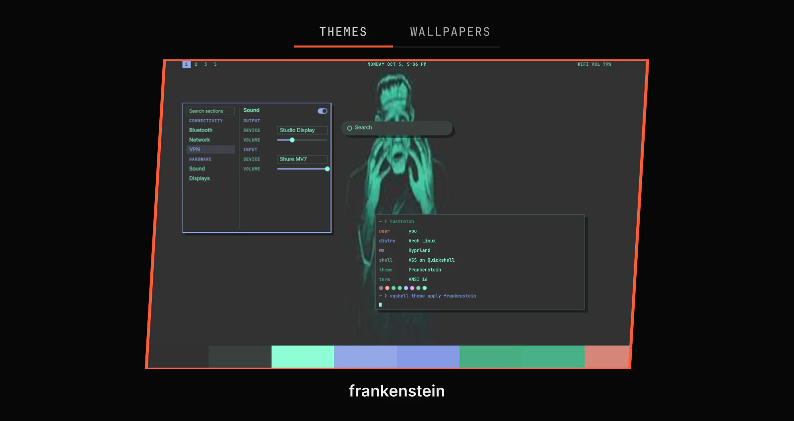

# VG Shell (VGS)

Quickshell + Hyprland. Everything is a plugin. Try it, you might like it.



## Features

- Settings window (SUPER+M): every plugin's settings, keys and an on/off switch.
- Add a plugin from a git URL; it stays off until you turn it on.
- Themes: one click changes colours, fonts, wallpaper and window borders.
- Updates for your system, VGS, plugins and themes in one window.
- Plugins do not depend on each other: turn one off and the others keep running.

## Install

Arch Linux:

```bash
paru -S vgshell-git
```

On Arch, the curl install and checkout need an installed AUR helper: paru or yay.

Any distribution:

```bash
curl -fsSL https://raw.githubusercontent.com/vanillagreencom/vgshell/main/install.sh | bash -s -- --git
```

Nix:

```bash
nix run github:vanillagreencom/vgshell -- run
```

From a checkout:

```bash
git clone https://github.com/vanillagreencom/vgshell
vgshell/bin/vgshell run
```

More install options: [docs/architecture/distribution.md](docs/architecture/distribution.md).

## How it works

VGS starts with Hyprland and draws the bar, panels and windows on each screen. Each of those is a plugin you can turn on, turn off, add or remove. A theme sets the colours and fonts every plugin uses.

## Plugins

<!-- Generated from each plugin's manifest.json by `node scripts/check-readme.js --write-plugins`. Do not edit by hand. -->

| Plugin | What it does |
|---|---|
| [Agent Warden](shell/plugins/vgs.agent-warden/README.md) | Keep your AI agents within their memory and process limits. |
| [Automations](shell/plugins/vgs.automations/README.md) | Run your commands on a schedule. |
| [Bar](shell/plugins/vgs.bar/README.md) | Workspaces, clock and plugin buttons on each screen. |
| [Bluetooth](shell/plugins/vgs.bluetooth/README.md) | Pair and connect your Bluetooth devices. |
| [Capture](shell/plugins/vgs.capture/README.md) | Save screenshots, record the screen and copy text from an area. |
| [Clipboard](shell/plugins/vgs.clipboard/README.md) | Find and paste anything you copied earlier. |
| [Dev Tools](shell/plugins/vgs.devtools/README.md) | Install and update developer tools. |
| [Displays](shell/plugins/vgs.displays/README.md) | Set each display's brightness. |
| [VGS Components](shell/plugins/vgs.gallery/README.md) | Preview VGS controls in the current theme. |
| [Login screen](shell/plugins/vgs.greeter/README.md) | Log in on a screen in your VGS theme. |
| [Jarvis](shell/plugins/vgs.jarvis/README.md) | Talk to a voice assistant. |
| [Key Hints](shell/plugins/vgs.keyhints/README.md) | See and change every shortcut VGS adds. |
| [Launcher](shell/plugins/vgs.launcher/README.md) | Find and open apps, files and system actions. |
| [Lock](shell/plugins/vgs.lock/README.md) | Lock your screen. |
| [Mouse](shell/plugins/vgs.mouse/README.md) | Set pointer and touchpad behavior. |
| [Network](shell/plugins/vgs.network/README.md) | Join Wi-Fi and see your network connections. |
| [Notifications](shell/plugins/vgs.notifications/README.md) | Read and silence your notifications. |
| [Polkit](shell/plugins/vgs.polkit/README.md) | Enter your password when an app needs administrator access. |
| [Scratchpads](shell/plugins/vgs.scratchpads/README.md) | Show and hide an app with one key. |
| [Settings](shell/plugins/vgs.settings/README.md) | Manage your plugins, settings and shortcuts. |
| [Sound](shell/plugins/vgs.sound/README.md) | Set the volume, the sound devices and each app's volume. |
| [System](shell/plugins/vgs.system/README.md) | Sound, displays, network and other system settings in one window. |
| [Themes](shell/plugins/vgs.themes/README.md) | Choose themes and wallpapers. |
| [Updates](shell/plugins/vgs.updates/README.md) | Update your system, VGS, plugins, themes and tools. |
| [Voice](shell/plugins/vgs.voice/README.md) | Dictate into the focused field and see the recording state in the bar. |
| [VPN](shell/plugins/vgs.vpn/README.md) | Connect Tailscale and choose an exit node. |

## Setup

The Arch and Fedora packages start VGS in a uwsm session. Otherwise add this line to `~/.config/hypr/hyprland.lua`:

```lua
hl.on("hyprland.start", function () hl.exec_cmd("vgshell run") end)
```

## Writing a plugin

Read [docs/architecture/plugins.md](docs/architecture/plugins.md). An agent loads the `vgs-plugin` skill, which scaffolds a plugin from templates and checks it.

## Licence

VGS is under the MIT licence: [LICENSE](LICENSE). Bundled fonts, icons and other third-party files: [DEVELOPMENT.md](DEVELOPMENT.md#licence).
