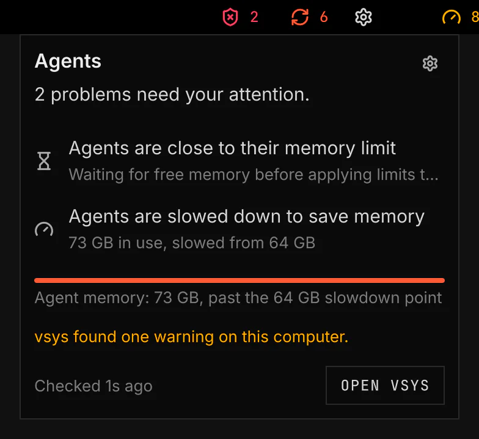

# Agent Warden

Agent Warden shows whether your AI coding agents stay within their memory and process limits. It is for people who run several agents on one computer. [vsys](https://github.com/vanillagreencom/vsys) provides the warden it reads.



Screenshot made with `scripts/readme-shots.sh` in the nested sandbox, with the default theme at scale 2.

## Features

- A shield in the bar. Its colour and icon follow the agents' state, with the number of running agents or problems beside it.
- A panel under the shield: one sentence on the state, the most serious items first, and the agent group's memory against its limit.
- Open vsys in the panel opens the vsys dashboard in a floating terminal.
- A desktop notification when an agent gets near a limit, when agents wait for memory, when a move fails, when leftover work is cleaned up, and when the warden stops checking.
- `SUPER+CTRL+Y` opens and closes the panel. The Keys row on the plugin's Settings page changes it.

## How it works

The plugin reads the warden's `status.json` and publishes the agent state for VGS to show. It observes limits and never enforces them. The warden runs as a systemd user timer, so its checks and corrections continue when VGS restarts or stops.

## Setup

The plugin's Settings page and its panel show each setup step as a button, only while the step is needed. Install vsys opens the install screen for vsys. Set up opens a floating terminal that starts the Agent Warden checks. Once Agent Warden runs, the page shows no setup button.

<details><summary>Show command</summary>

```bash
vsys warden install
```

</details>

| Setting | What it changes |
| --- | --- |
| Show count | Shows the number of running agents or problems beside the shield. |
| Hide when idle | Hides the shield when no agents run and no problems need attention. |
| Notifications | Alerts for problems, all events or none. Everything also tells you of each move back into limits. |

[developer.md](developer.md) states each state, notification and IPC function.
