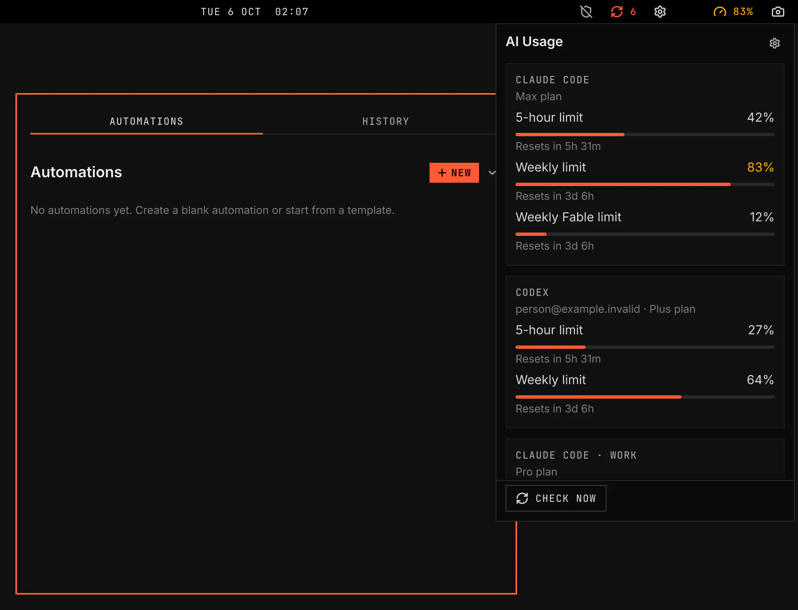

# AI Usage

AI Usage shows how much of your Claude Code, Codex and Copilot plan limits you have used. It reads each tool's own sign-in, so it needs no API key.



Images come from `scripts/readme-shots.sh` in the nested sandbox.

## Features

- The highest share of a visible plan limit used, in the bar. It turns to the warning colour at 80 %.
- A compact panel view with each visible account and one line for each limit and reset time.
- A full panel view with meters, plan details and provider details when the provider sends them.
- Copilot AI credits per account, with the amount used this month and the renewal date.
- Claude Code extra usage and Codex credit balance when those providers report them.
- Every Claude Code, Codex and Copilot account on this computer.
- Filters for providers and hidden accounts.
- The bar item stays hidden until you sign in to one of the visible tools. A click opens the panel.
- When a check fails, the panel keeps the last figures and says that they may be old.
- AI Usage never changes a tool's sign-in.

## Settings

| Setting | What it changes |
| --- | --- |
| Check interval | Time between usage checks. Opening the panel also checks. |
| View | Compact shows account identity and limit lines. Full adds meters and provider details. |
| Providers | Show or hide Claude Code, Codex and Copilot in the panel and bar total. |
| Hidden accounts | Hide selected accounts from the panel and bar total. |
| Sign-in | One row per tool. While no account of a tool is signed in, its row offers Sign in, which opens the tool's own sign-in in a terminal window. |

When a Claude Code or Copilot sign-in has expired, open that tool once to refresh it.

<details><summary>Show command</summary>

```bash
claude auth login
codex login
```

</details>

## Extras (not supported)

- **AI Gateway**, `aiGateway`: Vercel AI Gateway credits from an API key. `{ "id": "vgs.ai-usage", "aiGateway": true }` in `plugins` in `~/.config/vgshell/shell.json` turns it on. The Settings page then lists an AI Gateway key row with Connect. With it off, the plugin reads no AI Gateway key, calls no AI Gateway API and shows no AI Gateway row.

Each AI Gateway key is stored in libsecret under `service vgs-ai-usage` and `account ai-gateway`. The Settings page shows the key state: Present, Absent, Locked or Unavailable. **Connect** opens a masked field for the key. VGS stores it in your keyring through `secret-tool`, handing it over on stdin, never on a command line. **Disconnect** removes the stored key.

<details><summary>Show command</summary>

```bash
secret-tool store --label='VGS AI Usage AI Gateway key' service vgs-ai-usage account ai-gateway
```

</details>
