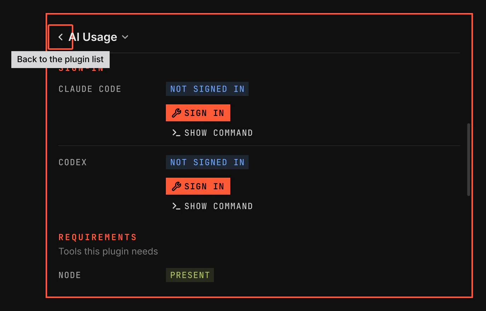

# AI Usage

AI Usage shows how much of your Claude Code, Codex and Copilot plan limits you have used. It reads each tool's own sign-in, so it needs no API key.

Images come from `scripts/readme-shots.sh` in the nested sandbox.

## Features

- The highest share of a plan limit used, in the bar. It turns to the warning colour at 80 %.
- A panel with each signed-in account: its email or name, its plan, a meter for each limit and the time the limit resets.
- Copilot AI credits per account, with the monthly reset and the amount used this month.
- Every Claude Code, Codex and Copilot account on this computer, including a second account in a separate tool folder.
- Sign in from Settings, through each tool's own sign-in.

## How it works

AI Usage finds the account folders the tools keep in your home folder and checks each one. For Claude Code, it sends the sign-in that Claude Code saved to the usage page that Claude Code reads. For Codex, it asks the Codex program for its limits. For Copilot, it reads the sign-in that the Copilot program saved in its folder or in the keyring. AI Usage never changes a tool's sign-in.

The bar item is hidden until you sign in to one of the tools. Click it to open the panel. A limit the tool does not report is not shown. A Codex sign-in with an API key has no plan limits, so the bar and the panel leave it out. When a check fails, the panel keeps the last figures and says that they may be old. When a Claude Code or Copilot sign-in has expired, open that tool once to refresh it.

## Settings

The Sign-in rows on the Settings page show each tool's state. While no account of a tool is signed in, its row offers Sign in, which opens the tool's own sign-in in a terminal window. The check interval sets the time between checks; opening the panel also checks.
