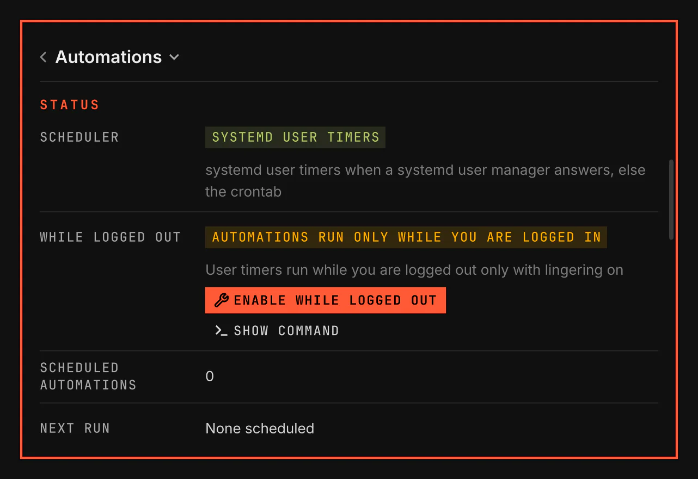

# Automations

Automations runs your commands on a schedule. It keeps each run's output and sends an alert when a run fails. Select the alert to open the output.



Screenshot made with `scripts/readme-shots.sh` in the nested sandbox, with the default theme at scale 2.

## Install

The plugin ships with VGS and is enabled by default. It needs `notify-send` (libnotify) and a systemd user manager; where none answers, it uses your crontab (`cronie`) instead.

## Features

- A window for list, editor, next-run preview and history.
- Every day, some weekdays, several times a day, every N days, weeks, months or years, a day of the month, the first to fifth or last weekday of the month, or a day of the year.
- An end: never, on a date, or after a number of runs.
- A preview of the next runs, from the same rules the timers follow.
- Per automation: paused or enabled, a multi-line shell command, a timeout, a working directory, catch-up of runs missed while the machine was off, and a notification for every start and finish, not only failures.
- Run now, a history of every run with its outcome and transcript, and clearing one automation's history or all of it.

## How it works

1. Select **New** in the Automations window to add a command and schedule.
2. The command writes a timer and a service for it under `~/.config/systemd/user/` and enables the timer. The service runs the plugin's runner, never your command directly.
3. At each run the runner starts your command in your login shell, so it finds what your terminal finds, and stops it at its timeout.
4. It saves a transcript, each output line with its time, and a record of the outcome under `~/.local/state/vgs/automations/runs/`.
5. A failure sends a red notification with the last error lines. With "notify on every run" on, a start and a green finish notification come too. Under the VGS notifications, a click on a finish or failure notification opens the transcript in your `$EDITOR`, or with `xdg-open`.

Open the window from the launcher rows "Automations" and "New automation". The editor uses presets first, then Custom for every N days, weeks, months or years. Once is stored as a schedule that ends after one run.

Timers stop when you log out unless systemd keeps your user manager running, which is called lingering. The plugin's Settings page shows whether it is on, and while it is off its **Enable while logged out** button opens a floating terminal that asks, then turns it on. The launcher lists the same step as "Run automations while logged out".

## The automations command

The command is `bin/automations` in the plugin's directory, run with the VGS tree first: `/usr/share/vgs` for an installed VGS, or the checkout. From a checkout:

```bash
alias automations="$PWD/shell/plugins/vgs.automations/bin/automations --tree $PWD"
automations add --definition '{"name": "Back up notes", "command": "rsync -a ~/notes /mnt/backup/", "schedule": {"frequency": "weekly", "interval": 1, "weekdays": ["mon", "thu"], "times": ["09:00"], "start": "2026-10-01", "end": {"type": "never"}}}'
automations list
automations run-now back-up-notes
automations history back-up-notes
automations preview --schedule '{"frequency": "monthly", "interval": 1, "monthly": {"by": "weekday", "week": 2, "weekday": "tue"}, "times": ["09:00"], "start": "2026-10-01", "end": {"type": "count", "count": 6}}'
```

The verbs are `list`, `add`, `edit`, `enable`, `disable`, `remove`, `run-now`, `history`, `clear`, `prune` and `preview`; `list` and `history` take `--json` for a program to read. The command's header states every verb, and `AutomationsLogic.js` every key of a definition. [automations.md](../../../docs/architecture/automations.md) holds the schedule rules, the files and how a run works.

## Settings

| Setting | Where | Default |
|---|---|---|
| Keep history, 1 to 30 days | the plugin's Settings page, or `historyDays` in its `plugins` row of `~/.config/vgs/shell.json` | 30 |
| Paused, timeout, catch-up, working directory, notify on every run | each automation's definition: `enabled`, `timeoutSeconds`, `catchUp`, `workingDirectory`, `notifyEveryRun` | enabled, 3600 s, off, your home, off |
