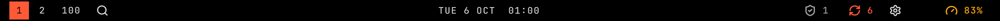

# Bar

The bar shows workspaces, the clock and plugin buttons at the top of each screen.

Screenshot made with `scripts/readme-shots.sh` in the nested sandbox, with the default theme at scale 2.

## Features

- One bar per screen, above windows, with space reserved so windows never sit under it.
- Built-in workspaces: one number per existing workspace, lowest first, the focused one highlighted. Click a number to focus that workspace.
- Keyboard access to a workspace uses the user's own Hyprland workspace binds. The bar itself takes no keyboard focus.
- Built-in clock: the date and time in the preset or custom format you choose. It ticks once a minute, or once a second when the format shows seconds.
- Three sections for plugin widgets, after the built-ins in each section. Enabling a plugin on its Settings page places its widget in the section its manifest names; `bar.layout` in `~/.config/vgshell/shell.json` places it anywhere. The shipped layout puts the Plugins gear, `vgs.settings`, in the right section.
- Colours, the font and every size follow the design tokens, so `~/.config/vgshell/theme.json` restyles the bar.
- Hide top bar, in the launcher's Style menu, hides the bar on every screen and gives its space to windows; the row then reads Show top bar and shows it again. The choice is the Hide top bar setting, kept in `~/.config/vgshell/shell.json`, so it holds across a restart and a login. The row sits under the Style category `vgs.themes` adds, so it is absent while that plugin is disabled.
- `SUPER+SHIFT+SPACE` hides or shows the bar the same way. Change it under Keys on the plugin's Settings page. `vgshell ipc call vgs.bar invoke toggle ''` is the same toggle over IPC. The bar's service registers both, `vgs.bar:toggle` and the IPC function, while the bar is the active one.

## Settings

On the bar's row in `plugins` in `~/.config/vgshell/shell.json`, for example `{ "id": "vgs.bar", "clockFormat": "HH:mm" }`:

- `left`, `center`, `right`: the built-in widgets each section shows, in order, from `workspaces` and `clock`. A name listed twice in one section is drawn once and the repeat is logged. `manager` draws nothing and logs `vgshell plugin enable vgs.settings`, which places the Plugins gear instead. Default: `["workspaces"]`, `["clock"]`, `[]`. An empty list hides them. These lists are not on the Settings page, since the page draws no list.
- `clockFormat`: the clock's preset or custom date and time format. Default: `ddd d MMM  HH:mm`.
- `hidden`: hide the bar on every screen; its surface is unmapped, so it reserves no space. The launcher's Hide top bar row and `vgs.bar:toggle` flip it. Default: `false`.

## Limits

- Only one bar is active at a time. Disabling it hides every plugin widget until a bar is enabled again.
