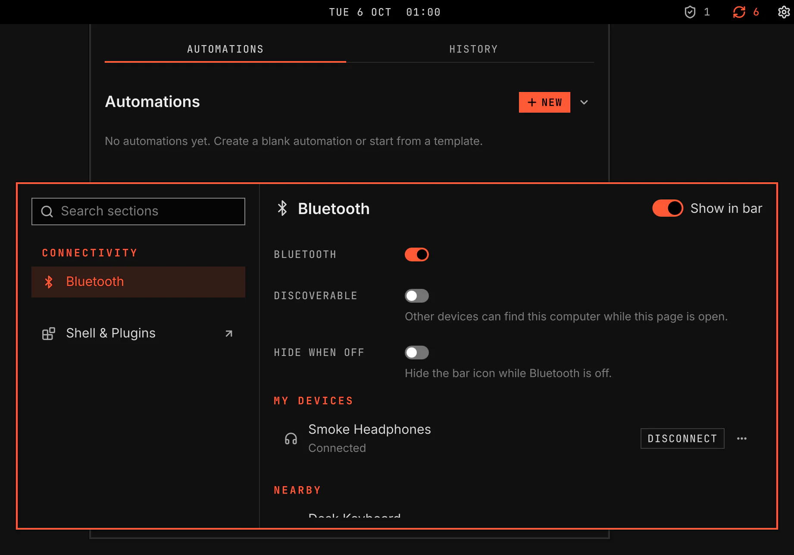

# Bluetooth

`vgs.bluetooth`: turn Bluetooth on and off, and pair, connect, rename and forget your devices. It has a bar icon with a flyout, and a Bluetooth section in the System Settings window.

Screenshot made with `scripts/readme-shots.sh` in the nested sandbox, with the default theme at scale 2, over the sandbox's Bluetooth fakes.

## Where you find it

| Surface | What it holds |
|---|---|
| Bar icon | Off, on, or connected with the count of connected devices. A click opens the flyout. It hides when no adapter is found, and while Bluetooth is off when Hide when off is on. |
| Flyout | The title row's power switch, your devices, which a click connects or disconnects, and the devices nearby. A click on a nearby device opens the Bluetooth section, which pairs it. Bluetooth Settings opens the section. |
| System Settings → Bluetooth | The power switch, Discoverable, Hide when off, My Devices with Connect or Disconnect and a menu of Rename, Trust and Forget, and Nearby with Pair. |

## Power

- Off blocks every Bluetooth radio with rfkill. The block stays after a restart: systemd keeps rfkill blocks across a boot, and BlueZ does not keep its own power state.
- On removes the block and waits up to 2 seconds for an adapter to power up. If none does, VGS powers the adapters itself and waits again. If Bluetooth is still off, the section shows "Bluetooth did not turn on."
- A hardware switch that turns the radio off shows "Turned off by a hardware switch". VGS cannot change it, so the switch is not offered.
- With no adapter and the Bluetooth service stopped, System Settings → Bluetooth and the plugin's Settings page offer Turn on the service, which starts the service in a setup window.
- The plugin needs `rfkill`. When it is missing, VGS offers to install it.

## Pairing

- Pair takes the core's pairing agent while it runs. Every request from the device shows in a dialog in the section: confirm a code, enter a PIN or passkey, type the shown code on the device, allow a service, or a cancel from the device.
- Discoverable lets other devices find this computer and pair with it while the section is open. It holds the pairing agent too, and turns off when you leave the section.
- A paired device is trusted and connected.
- If another app handles Bluetooth pairing, the section says so and pairs nothing.

## Keys

The bar takes no keyboard focus. `SUPER+PERIOD` opens the System Settings window: type "bluetooth" and press Enter. In the section, Tab moves between the switches and the lists, Space turns a switch on or off, Up and Down move in a list, Enter runs the selected device's action, Shift+F10 opens its menu, and Delete forgets it. Escape returns to the sidebar.

## Validation

`scripts/test-bluetooth-logic.js` holds the power steps, the discovery stops, the pairing steps and the device lists, each rule with a control. `scripts/smoke/rows/bluetooth.sh` runs the plugin in the nested sandbox over a BlueZ mock and a stand-in `rfkill`: Off, a restart, On with and without the automatic power-on, a hardware switch, a discovery that BlueZ confirms after the flyout closed, two pairings through the agent, Connect and Disconnect, and the keyboard path. [capabilities.md](../../../docs/architecture/capabilities.md) holds the contract.
