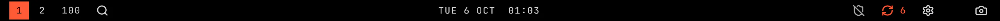
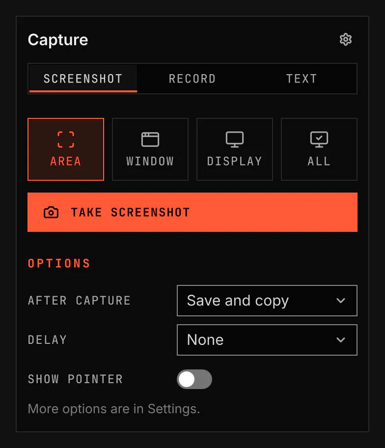

# Capture

Capture takes PNG screenshots. It can save them, copy them, or do both. It also records the screen on Arch and copies text from a selected area in the languages you choose.

Images come from `scripts/readme-shots.sh` in the nested sandbox.

## Features

- Screenshot of the focused output.
- Area screenshot over a still screen. A click selects the window or display under the pointer.
- Selection of a window or display, or one image of all displays.
- Screenshot delay with a countdown in the bar. The same key or a click on the countdown cancels.
- Choice of save and copy, copy only, or save only. The pointer is optional.
- Screen recording of an area, a window, a chosen display, the focused display, or what the desktop's screen picker shares. A click selects the window or display under the pointer, and a box that covers a whole display records that display.
- Recording quality, frame rate, codec, constant frame rate and pointer choices.
- Desktop audio, microphone audio, both or neither, plus extra audio sources, each on its own track.
- An optional camera picture in the corner of a recording.
- Finished recordings lose their first tenth of a second and get even loudness. The original stays when that step fails.
- Text recognition from a selected area in one or more languages, with the spacing between words kept.
- A notification for each finished capture. Open and Edit start your own image viewer, image editor or video player.
- Capture options and a recording indicator in the bar.

## How it works

Click Capture to open its options. A screenshot uses the selected result choice. A notification names a saved file or confirms a copy. On a saved screenshot, Open shows the image in the image viewer and Edit opens it in the image editor. On a saved recording, Open plays it in the video player. A click on the notification does what Open does. A button shows only when its program is installed, and Dismiss closes the notification. The notifications need the Notifications plugin or another notification service. Selection holds the screen still and shades it while you choose a box. Escape or the same key cancels selection. A delayed screenshot releases the still screen after selection and captures new content when the countdown ends. Recording offers windows and outputs as boxes like an area screenshot. Click the recording indicator, or press any recording shortcut again, to stop and save. The next capture can start while Capture finishes the saved recording. The saved notification names the file, and a recording that failed to start or stopped early shows the end of the recorder's log in a notice. A missing tool opens the install notice for the action that needs it.

## Settings

Set the screenshot result, click selection, delay, pointer, time limit, folders, recording audio, quality, frame rate, codec, recording pointer, extra audio sources, camera, recording cleanup and text languages in the Capture panel or Settings. Capture lists the audio sources and cameras PipeWire offers without opening them. A camera that is switched on but not connected stops the recording before it starts. Empty folder fields use Screenshots in your XDG Pictures folder and Screencasts in your XDG Videos folder. Custom folders use an absolute path or start with `~/`. The Keys row in Plugins changes each shortcut. Set the image viewer, image editor and video player in Plugins. Each is a command, where `%f` stands for the file; with no `%f` the file comes last. imv, Satty and mpv are the defaults, and the Requirements list in Plugins shows whether each is installed.

Every saved recording puts its file link on the clipboard, which replaces what the clipboard held.

Recording needs `gpu-screen-recorder` on Arch. Fedora shows recording as unavailable when that tool is absent. Text recognition reads English unless you choose other languages. When Tesseract is absent, the Arch install notice installs `tesseract-data-eng`, which also installs Tesseract. When a chosen language's data is missing, the Text languages status offers Install languages in Plugins and in the Capture panel; on Arch and Fedora it installs that data, and on NixOS it names the languages to add to the system configuration. If Tesseract cannot read a chosen language's data, Capture shows that error and keeps the clipboard.

## IPC

These optional commands address the service on a running VGS session.

| Action | Command | Shortcut name | Default key |
|---|---|---|---|
| Focused-output screenshot | `vgshell ipc call vgs.capture invoke screenshot ''` | `vgs.capture:screenshot` | Print |
| Area screenshot | `vgshell ipc call vgs.capture invoke screenshot-area ''` | `vgs.capture:screenshot-area` | Super+Shift+S |
| Window screenshot | `vgshell ipc call vgs.capture invoke screenshot-window ''` | `vgs.capture:screenshot-window` | None |
| Selected-display screenshot | `vgshell ipc call vgs.capture invoke screenshot-display ''` | `vgs.capture:screenshot-display` | None |
| All-display screenshot | `vgshell ipc call vgs.capture invoke screenshot-all ''` | `vgs.capture:screenshot-all` | None |
| Start or stop recording an area | `vgshell ipc call vgs.capture invoke record ''` | `vgs.capture:record` | Super+Shift+R |
| Start or stop recording a window | `vgshell ipc call vgs.capture invoke record-window ''` | `vgs.capture:record-window` | None |
| Start or stop recording a chosen display | `vgshell ipc call vgs.capture invoke record-display ''` | `vgs.capture:record-display` | None |
| Start or stop recording the focused display | `vgshell ipc call vgs.capture invoke record-output ''` | `vgs.capture:record-output` | None |
| Start or stop recording through the screen picker | `vgshell ipc call vgs.capture invoke record-portal ''` | `vgs.capture:record-portal` | None |
| Copy text | `vgshell ipc call vgs.capture invoke text ''` | `vgs.capture:text` | Super+Ctrl+Print |
| Open or close options | `vgshell ipc call vgs.capture invoke toggle ''` | `vgs.capture:toggle` | Super+Ctrl+Shift+S |
