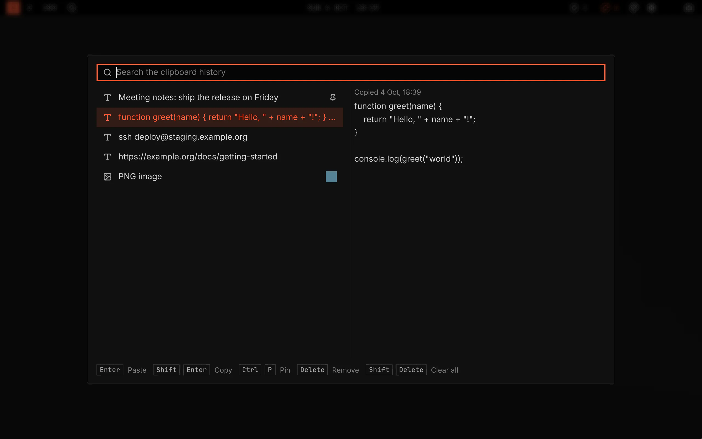

# Clipboard

Clipboard keeps what you copy. Open the history with `SUPER+CTRL+V`, find an earlier copy and paste it again.

Screenshot made with `scripts/readme-shots.sh` in the nested sandbox, with the default theme at scale 2.

## Turn it on

Clipboard ships with VGS and is off until you turn it on, so VGS records no copy before you ask. It stays off because, once on, it saves every copy to disk, and that includes a password copied from an app that does not mark it as secret. Open Plugins, select Clipboard in the plugin list and turn the plugin on. Turn it off there to stop recording; the history you have stays.

## Features

- A history of your last 500 text and image copies. It stays after a restart.
- Type to find an entry. Find an image entry by "image" or by its type, such as "png".
- Paste an entry into the application you work in, or put it on the clipboard only.
- Pin an entry. A pinned entry stays first, and stays when you clear the history or the history is full.
- A copy that a password manager marks as secret is never recorded.

## How it works

`SUPER+CTRL+V` opens the history on the focused monitor. The entries are on the left: pinned entries first, then the newest. The selected entry shows on the right. Typing goes to the search field and shows only the entries that hold the text, in upper or lower case. The list shows 50 entries: type to find an older one. The search reads the first 8192 characters of an entry.

| Key | What it does |
|---|---|
| Enter, or a click on an entry | Pastes the entry into the application that had the keyboard. |
| Shift+Enter | Puts the entry on the clipboard and pastes nothing. |
| Ctrl+P | Pins the entry, or lets its pin go. |
| Delete | Removes the entry. |
| Shift+Delete | Clears the history after a question. Pinned entries stay. |
| Up, Down, Page Up, Page Down, Ctrl+Home, Ctrl+End | Move the selection. |
| Escape | Clears the search, then closes the history. |

A paste puts the entry on the clipboard, closes the history and sends the paste key to the application: Ctrl+Shift+V to a terminal, Ctrl+V to any other application. VGS reads which application has the keyboard from its desktop entry. When VGS cannot name the application, it sends no key and shows a message. The entry stays on the clipboard for you to paste.

## Recorded copies

- Text up to 1 MiB and an image up to 16 MiB. A larger copy is not recorded.
- A copy that offers both plain text and an image is recorded as text.
- A copy is not recorded when its source marks it as secret. KeePassXC and other password managers set that mark. A copy from a program that sets no mark is recorded like any other copy.
- The selection you paste with the middle mouse button is not recorded.
- The history is in `clipboard/` under `~/.local/state/vgshell/`, or under `$XDG_STATE_HOME/vgshell/` when that is set. Only your user can read it. It is not encrypted.
- An image file is deleted when no entry uses it.

## Settings

The Keys row on the plugin's Settings page changes `SUPER+CTRL+V`. The same page lists `wl-paste` and `wl-copy`, from wl-clipboard, and `wtype`, and installs the missing ones.

## Developer interface

| Path | How |
|---|---|
| Shortcut | `vgs.clipboard:toggle`, `SUPER+CTRL+V` by default. |
| Open or close | `vgshell ipc call vgs.clipboard invoke toggle ''` |
| Rows for a filter | `vgshell ipc call vgs.clipboard invoke rows '<filter>'` answers `{ images, total, rows }`, at most 50 rows. |
| Change an entry | `vgshell ipc call vgs.clipboard invoke paste <id>`, and `copy`, `pin` and `delete` in its place. Each answers `ok` or a `refused:` line. |
| Clear | `vgshell ipc call vgs.clipboard invoke clear ''` |

[clipboard.md](../../../docs/architecture/clipboard.md) holds the plugin's rules and the tests that enforce them.
