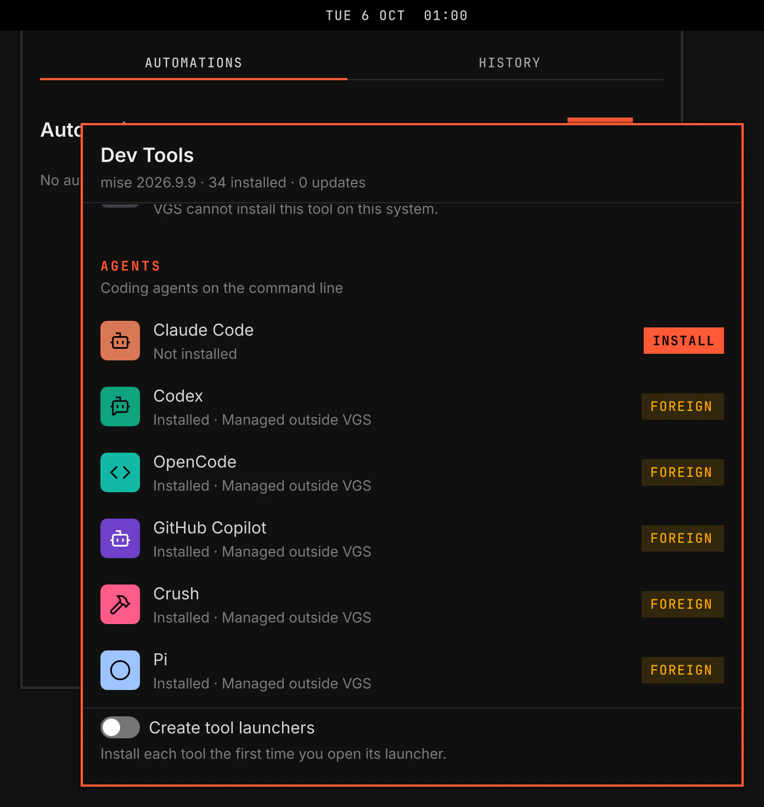

# vgs.devtools

Dev Tools installs, updates and removes developer tools. Its window shows the VGS version and missing tools.

Screenshot made with `scripts/readme-shots.sh` in the nested sandbox, with the default theme at scale 2.

## Files

- `catalog.json`: The data source for agents, apps, tools, environments, editors, terminals and databases.
- `Appearance.js`: The plugin-owned brand colour table. `scripts/check-devtools-catalog.js` accepts it through `ThemeLogic.acceptAppearance` in dark and light mode.
- `CatalogLogic.js`: The pure catalog judge and the catalog's rules: a mise spec's parts and key, the spec a row installs, the specs a row declares and the machines a row builds on. It imports nothing. Callers inject the package-manager ids, Lucide icon names, brand table and package-name rule through `judgeCatalog`.
- `bin/devtools`: The engine, in node. Its header states each verb, its output and its refusals.
- `tui/devtools.sh`: The floating TUI script. `install.sh`, `update.sh` and `remove.sh` run it with their verb. Its header states the arguments and refusals.
- `Service.qml`, `Query.qml`: The service and the one read-only command each of its queries runs.
- `Window.qml`, `ToolRow.qml`: The window and one of its rows.
- `ViewLogic.js`: Every decision the service and the window make, pure.
- `scripts/check-devtools-catalog.js`: The command-line check. It prints `<rule> <path> <detail>` for each refusal.
- `scripts/test-devtools.sh`: The engine's and the TUI scripts' suite, with a stub mise, pacman, sudo, uname and gum.
- `scripts/test-devtools-view.js`: `ViewLogic.js`'s suite. `scripts/smoke/rows/devtools.sh` is the plugin's row in the nested sandbox.

## Catalog

The catalog's sections, fields, install routes, mise specs and security rules are in [docs/architecture/devtools-catalog.md](../../../docs/architecture/devtools-catalog.md).

## Engine

`bin/devtools --tree <dir> <verb>` runs against the VGS tree at `<dir>`. Its header states each verb, its output and its refusals. The verbs are `list --json`, `install`, `update` and `remove` for one row or, with `--mise <key>`, for a tool that only the owner's global mise config declares, and `launchers refresh|remove`.

- The engine refuses the whole catalog when `CatalogLogic.judgeCatalog` refuses one row.
- Install, update and remove run only in a terminal, never in a process the shell started, through `refuseOutsideTerminal` in `bin/lib/judge-files.js`, the rule `vgshell pkg run` follows. The floating TUI script `tui/devtools.sh` is where they run.
- Each mise, container and installer step runs through `bin/lib/pkg-run.sh` from `$HOME`, with `MISE_MINIMUM_RELEASE_AGE=0` and the row's `buildEnv`. Before `mise use` or `mise up`, the engine sets mise's `upgrade.auto_prune` to false when it is not false already; otherwise an upgrade deletes the release a running session still executes.
- `update` installs a row whose `present` probe fails after `mise up` again with `mise use -g --force` and its `buildEnv`, then runs its `postInstall` steps again, so rails and phoenix follow the new ruby and elixir.
- The engine never installs a tool that only the owner's mise config declares, so that config stays the source of truth.
- A named installer downloads its upstream script to a temporary file and runs it with `sh`; no shell string passes through the engine. `rustup` removes itself with `rustup self uninstall -y`. The `opam` binary that the opam installer puts in `/usr/local/bin` stays after a removal, because only root can delete it.
- A removal whose row's `present` probe still holds is refused with `present=remains`: something VGS did not install provides it.

## Window and service

The service owns every command the plugin runs in the background. The window draws what the service publishes and runs nothing itself.

- The window is a Hyprland window titled Dev Tools, of class `org.vgs.shell`. It opens floating and centred on the focused monitor, 600 pixels wide and 600 pixels tall, or the monitor's size less a margin a side on a smaller one, and its rows scroll inside it. Hyprland draws its border and moves, resizes, tiles and closes it like any other window: click another window to type there, and use your own keys to move it or tile it. Escape closes it while it has the keyboard. To tile the shell's windows by default, add `hl.window_rule({ name = "vgs:window", enabled = false })` to `hyprland.lua` after the line that loads the VGS layer.

- The service runs four read-only queries: the engine's `list --json`, `vgshell doctor --json`, `vgshell self status --json` and `vgshell pkg check --json --source mise`. It runs them at start and on IPC `refresh`. IPC `open` summons the window and runs them too, but it asks the network again only when that answer is older than 10 minutes. When one of the plugin's TUI runs ends, the service lists again and asks doctor and mise again. When the core's scan finds another set of missing commands for the core or an enabled plugin, through the `doctor` capability's `missing`, it lists again and asks doctor and mise again, since an install the core ran can bring mise itself.
- The service publishes plugin status: `mise` (its version, or Not installed), `checks`, `installed`, `outdated` and `missingRequirements` for the Settings page, and `catalog`, the data the window draws. A count keeps its last answer when its query fails, and `checks` reports whether a query failed.
- The window shows the VGS section, then Agents, Apps, CLI tools, Languages, Editors, Databases, Terminals and Other mise tools. Each row shows its icon on a brand tile, its version, where it comes from, a channel `Select` for an install, and Install, Update or Remove. A row that something outside VGS provides shows Managed outside VGS and offers no action.
- The window opens on its scrollable body. Tab reaches row actions in reading order, and the body scrolls each focused action into view. The initial focus never lands on Install, Update or Remove, so a summon cannot start a system change. `scripts/smoke/rows/devtools.sh` reads that focus state before it runs any fixture TUI.
- The VGS section shows how VGS is installed and its version. When VGS is behind, Update opens the first TUI entry of group `Update`, which the Updates plugin declares. The section also lists every missing requirement of VGS and of each enabled plugin. Install raises the core's requirement notice for that command through the `doctor` capability ([requirement-notice.md](../../../docs/architecture/requirement-notice.md)).
- Every action opens the plugin's floating TUI. The install, update and remove entries are listed in group `Dev Tools`. Opened with no row, as the launcher opens them, each offers the rows its verb accepts now, from the engine's `targets` verb.

## Launchers

A launcher is a script at `~/.local/bin/<command>` that installs its row through mise on the first run and then runs it. The plugin's `writeLaunchers` setting, off by default, asks for them. The window's switch writes it. The service runs `launchers refresh` while it is on and `launchers remove` while it is off, at start, when it changes and after each TUI run.

- A launcher's second line is `# vgs.devtools launcher`. A file without that mark, a link included, belongs to the owner: the engine never replaces or deletes it, so the owner's `agent-cli` links stay the owner's.
- The engine writes no launcher where the command already answers on `PATH` outside `~/.local/bin` and mise's data directory, because the launcher would hide that copy; it reports that launcher `shadowed`.
- A row with `exec`, such as Cursor, installs with an empty `bin_path=`, so mise puts nothing on `PATH`. Its launcher runs the `exec` file below the directory `mise where` names. The engine writes it after each install and update whatever the setting, and `launchers remove` keeps it while the row is installed.
- A launcher runs the row's default channel.

## Omarchy comparison

Omarchy uses `omarchy-install-dev-env` case arms and `omarchy-menu.jsonc` rows with bash `disabled` checks. Its Install › Development menu shows no version and no source, and removal is a second menu. VGS shows every row in one window with its state, and lists it again when the TUI ends.

VGS uses `catalog.json` rows plus `present` probes. The engine can list, install and remove tools from one data file without parsing menu shell snippets.

VGS keeps Omarchy's environment set, editor set, terminal set and Docker database defaults. VGS changes the install representation to package-manager ids, mise specs, named installer routes and container data.

Omarchy sets the PHP mise alias to `github:nunomaduro/static-php-builds` before installing PHP. VGS uses that spec directly, because bare `php` can build PHP from source and needs many system development packages.

Omarchy's `omarchy-mise-install` writes a wrapper for each agent at setup. VGS writes launchers only when the owner asks for them, because mise's shims and the owner's own `agent-cli` link already run each tool. Omarchy's `install/user/mise.sh` sets `upgrade.auto_prune` false once at setup; the engine sets it before its first `mise use` or `mise up`. Omarchy runs `sudo docker run` for its databases; the engine runs the first container runtime of the row on `PATH` without `sudo`, so a user without access to that runtime sees its error in the TUI.
