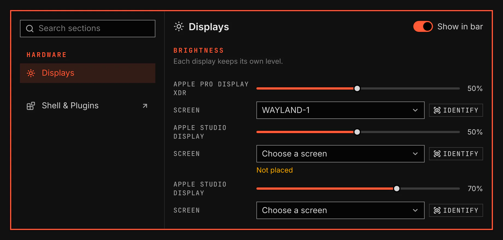

# Displays

Displays sets each screen's mode, scale, orientation and brightness. Apple Pro Display XDR and Apple Studio Display brightness works over USB, other external displays over DDC, and a laptop's built-in display over its backlight.



Screenshot made with `scripts/readme-shots.sh` in the nested sandbox, with the default theme at scale 2, over the sandbox's fake Pro Display XDR and two Studio Displays.

## Features

- A brightness item in each bar. It controls the display on its own screen: scroll to change the brightness, click to open the flyout. It hides while no display it can control lights that screen.
- A flyout with one slider per display, the bar's own display first, Link displays, and Display Settings.
- The brightness keys change the display you work on, or every display. An on-screen display shows the new level.
- System Settings → Displays: a display arrangement canvas, each screen's resolution, refresh rate, scale, orientation and brightness, the screen a display shows on when VGS cannot tell, Identify, Link displays, Dimming, and the access each kind of display needs.
- A display mode change first opens a trial. Keep saves it, and Revert or the timer restores the old mode.
- Identify shows each screen's name and flashes the display, so you can tell two displays of one model apart.
- The displays dim after a time without input, to a level you choose. Any input brings each display back to its level. A playing video keeps the displays from dimming.
- When a display needs your permission, Allow opens a terminal that shows the one-time setup and asks for your password.

<details><summary>Show command</summary>

```bash
vgshell system apply apple-displays
vgshell system apply i2c-dev
```

</details>

## Settings

| Setting | What it changes |
| --- | --- |
| Key and scroll step | How much one brightness key press or bar scroll changes the level. |
| Brightness keys change | The display the brightness keys change: the one you work on, or all. |
| Link displays | Change every display by the same amount. |
| Dim when inactive | Time without input before the displays dim, or Never. |
| Dimmed brightness | The level the displays dim to. A display already darker keeps its level. |

The keys are `XF86MonBrightnessUp` and `XF86MonBrightnessDown`. The Keys row on the plugin's Settings page changes them.
