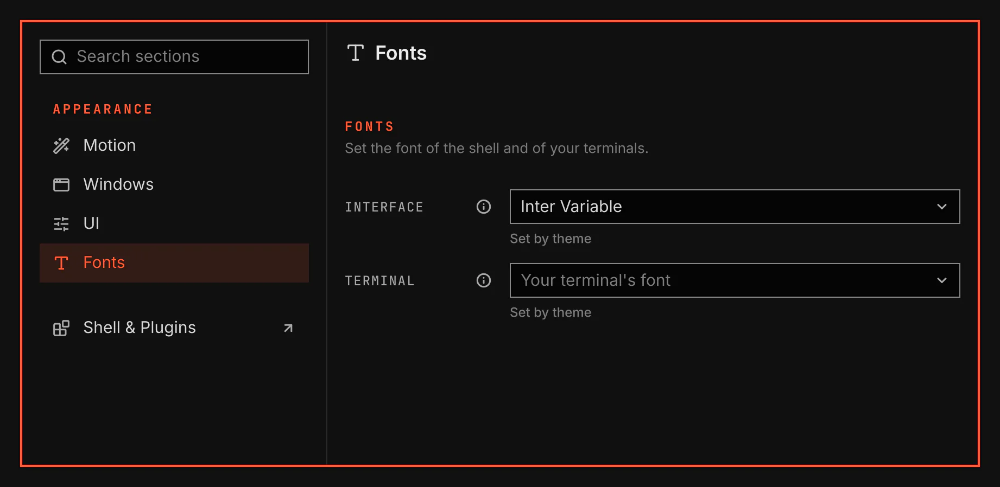

# Fonts

Fonts sets the font of the shell and the font of your terminals. It is for anyone who wants another typeface than the theme gives.

Screenshot made with `scripts/readme-shots.sh` in the nested sandbox, with the default theme at scale 2.

## Features

- A Fonts section under Appearance in the System Settings window.
- Each value shows Set by theme until you change it. Use theme value puts the theme's value back.
- The Interface list holds the fonts installed on your computer, each family once. The Terminal list holds only the fixed-width ones that draw letters, digits and punctuation, so icon and emoji fonts stay out of it. Type the first letters of a name to move to it.
- The values stay in effect when you disable this plugin. Enable it again to change them.

## Values

| Value | What it changes |
| --- | --- |
| Interface | The font of the shell's text: body text, headings, labels, buttons and the bar. Code and key names keep the theme's fixed-width font. The launcher and notifications keep their own fonts. |
| Terminal | The font of Kitty and Ghostty. Kitty changes at once. In Ghostty, open a new window if the font does not change. Without a font here, each terminal keeps the font from its own config. |

## Limits

- The terminal font reaches a terminal after you apply a theme in Themes, because VGS writes it into the theme files that terminal reads.
- VGS does not write the terminal font while you edit the theme file by hand. Apply a theme again to write it.
- A font that your own Kitty config sets after the VGS line stays in effect in Kitty.
- The Terminal list holds the fonts that fontconfig reports as fixed-width and as drawing every letter, digit and punctuation mark of plain English text. A font it does not report so is not in the list.
- A style such as Light or Medium is not its own entry in either list.
