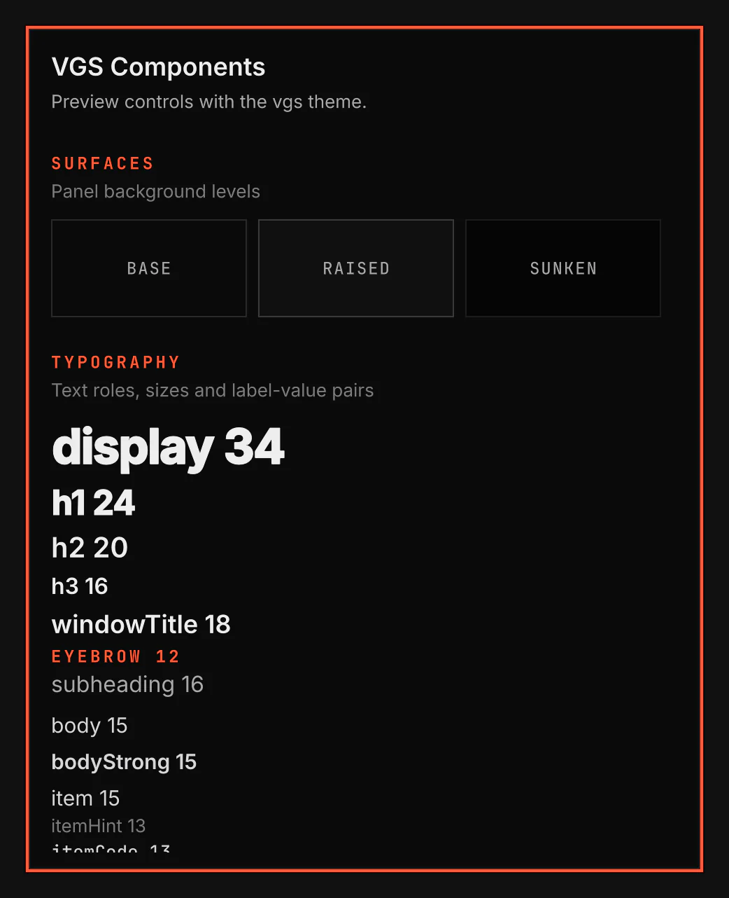

# VGS Components

VGS Components previews the controls and states in the current theme. The plugin id is `vgs.gallery`.

Screenshot made with `scripts/readme-shots.sh` in the nested sandbox, with the default theme at scale 2.

## Opening it

`vgsh ipc call shell summon window vgs.gallery '{}'` opens it on the focused monitor. `vgsh ipc call shell hide window vgs.gallery` closes it, and `... toggle window vgs.gallery '{}'` does either.

## The window

- A Hyprland window titled VGS Components, of class `org.vgs.shell`. It opens floating and centred at the theme's `size.panel.lg` by `size.panel.maxHeight`, and takes the keyboard. Hyprland draws its border and moves, resizes, tiles and closes it like any other window: click another window to type there, and use your own keys to move it or tile it. To tile the shell's windows by default, add `hl.window_rule({ name = "vgs:window", enabled = false })` to `hyprland.lua` after the line that loads the VGS layer.
- Escape closes it while it has the keyboard, unless a control in it takes the key first, as an open menu or select does. Your close key closes it too.
- One section per group of components: the surface levels, the text roles with a text holding an inline image, buttons, choices, inputs, feedback, dialogs, cards, the carousel, titles and scrolling, and lists. Every example follows the applied theme, so applying another theme restyles the whole window at once.
- Show a toast raises a real toast through the core. It is built only while it is open, so a closed gallery costs nothing.

## Validation

`scripts/smoke/rows/gallery.sh` opens it in the nested sandbox, reads every component of `qs.Ui` back from it, holds every example inside its right edge, shows a toast and closes it, and reads it as a Hyprland window: its class and title, its border in the active and inactive colours, a move, focus and Escape. `scripts/smoke/rows/themes.sh` reads one colour per section under the catalog's light `flexoki-light` theme.
