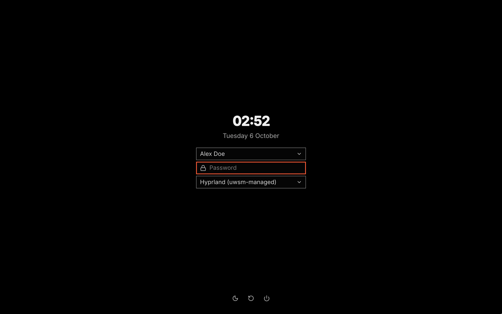

# Login screen

`vgs.greeter`: log in on a screen in your VGS theme, with the lock screen's look. Pick your account and your session. On the first login it chooses "Hyprland (uwsm-managed)", the session in which VGS and your user services get the session environment.



Screenshot of the `greeter` scene of `scripts/sandbox-shots.sh` in the nested sandbox, with the default theme at scale 2, over fixture sessions and one fixture account, cut and encoded the way `scripts/readme-shots.sh` does for its row.

## Install

The plugin ships with VGS. The login screen itself is off until you turn it on: open Settings → Login screen and press Set up. A terminal shows each file the setup writes and asks for your password once. The login screen shows at the next boot.

Setup needs greetd and its greeter account, which the greetd package makes, and VGS installed from a package: the login screen runs only files that no account can change. If another login screen, such as GDM or SDDM, is turned on, Set up is not offered and VGS leaves that login screen alone. In that case, pick "Hyprland (uwsm-managed)" on that login screen: it starts the same session.

<details>
<summary>Show command</summary>

```sh
vgsh system apply greeter
vgsh system undo greeter
```

</details>

## Features

- The time, your accounts and a password field, drawn in your theme over your background on every screen.
- A session picker with every installed session: Hyprland, Hyprland (uwsm-managed), GNOME, Plasma and any other Wayland or X11 session.
- The first login chooses Hyprland (uwsm-managed). After that, the login screen remembers your last account and each account's last session.
- A password login also unlocks your login keyring, so apps that use the keyring start signed in.
- The login screen types with the system keyboard layout. A layout without Latin letters gets US English first; Left Alt + Right Alt switches between them.
- A fingerprint or another method works as your system's login configuration sets it: press Enter with the password field empty.
- Suspend, Restart and Shut down.
- Removing the setup puts back the login configuration that was there before.

## How it works

1. Set up writes three files that belong to VGS: a greetd configuration, a login configuration that adds the keyring, and a systemd drop-in that starts greetd with the VGS configuration. It turns greetd on for the next boot, and sets the computer to start in graphical mode if it started in text mode. It never changes greetd's own configuration files.
2. At boot, greetd starts Hyprland as the greeter account, and Hyprland shows the login screen.
3. While the setup is in place, the plugin copies your theme and your background to a folder the login screen can read, each time you change them.
4. After you log in, the login screen hands your session to greetd and closes.

## Settings

The plugin has no settings. The Settings page shows whether the login screen is set up and whether its copy of your theme is up to date.
