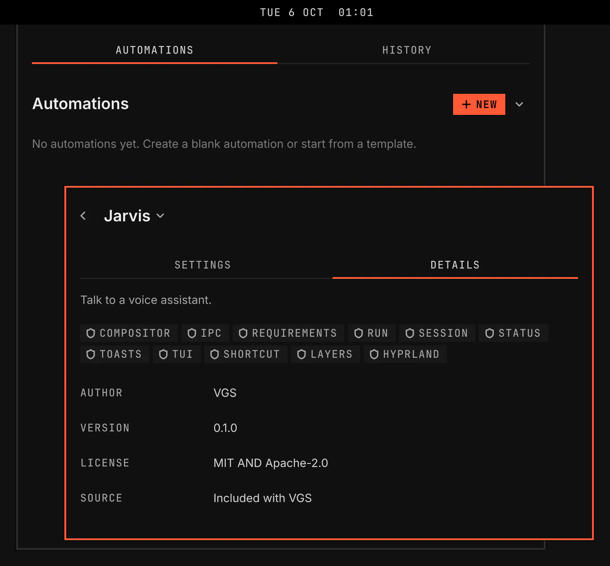

# Jarvis

Jarvis is a voice assistant for your desktop. You talk to it, it answers through the AI model you choose, and it can act on your windows, files, clipboard, media, screen and a private browser.

Screenshot made with `scripts/readme-shots.sh` in the nested sandbox, with the default theme at scale 2.

## Features

- A bar icon that shows whether Jarvis is off, ready, listening, working, muted or has a problem. A click toggles mute.
- Talk, Mute, Stop and Console keys. Talk is Super with Right Alt, Mute is Super with Shift and Right Alt, Stop is Super with Alt and Period, and Console is Super with Alt and C.
- The Console window lets you type a message to Jarvis, review the conversation, and stop the current turn without using the microphone.
- Mute stays on across restarts and blocks talk input.
- A listening bubble whose orb and text let clicks reach the application below.
- An AI model from an API key you added, or from an app you are signed in to, such as Claude Code, Codex, GitHub Copilot or Pi with its own providers.
- Local voice: speech to text and spoken replies on your computer, with no network access, after Set up local voice.
- Half duplex audio: Jarvis closes its microphone while speech plays, and Talk interrupts speech.
- Provider keys stored in your desktop keyring. Plugins shows whether a key is present, absent, locked or unavailable without reading it.
- Accounts finds the account folders of other tools in your home, config and data folders, and can remember a key another tool stored without copying its value. A login hint never proves that the AI answers.
- Verify sends one small request to an account after you consent, because a real request may cost money.
- Window, workspace and application tools that read each change back from Hyprland before they report it done.
- File tools that list, read, search, write, move and delete files in your home folder. They refuse credential stores, account folders and VGS's own files, and never follow a link out of your home folder.
- Shell tools that keep commands inside a kernel sandbox. Plugins shows whether the sandbox is ready and offers Install Bubblewrap when it is missing.
- Desktop tools that read and copy clipboard text, play, pause and skip media, set and mute the speaker volume, and show a notification. A clipboard read refuses a copy that a password manager marks as secret.
- Screen tools that read the screen, a monitor, a window, a region or an area you draw, at most four times a turn. Windows of password managers and private browsing are painted black before a screenshot leaves Jarvis.
- A private browser from Set up browser. Jarvis asks for input access to each site, a submit needs your confirmation, and password entry stays with you.
- Coding tasks in their own tmux session or a floating terminal. Plugins shows how many are running. A stop ends every process of the task before it is recorded as stopped.

## Setup

The Setup section at the top of the Jarvis page says Ready when Jarvis has an AI model it can use and local voice, and Not ready when it does not. It offers Sign in, AI model, Local voice, Browser and Input. The AI model and local voice steps read Done or To do. Sign in is optional. The browser and input steps read Optional until they are done.

Each setup step is a button on the Jarvis page in Plugins or a row in the launcher's Jarvis group. Each opens a floating terminal.

- Add key stores a new API key from an AI provider in your keyring, with hidden key input. You choose the provider from a list that names the page where it makes keys, then give the key a name.
- Sign in opens Claude Code or Codex's own sign-in. Give a new account a name, or select an existing account folder. Jarvis shows the folder before sign-in and creates it if needed. After sign-in, select the account as the AI model. The app keeps its login token.
- Set up local voice lists the tiers this computer can run, with the download size of each, and recommends the first. It checks free space, downloads the models and a private runtime, and reports Ready only after verification and a bundled test clip succeed.
- Set up browser checks an installed browser on a blank page, or offers a private download. The Browser driver row offers Install while agent-browser is missing.
- Accounts adds a directory, chooses an existing keyring item by label or inspects login hints.
- Check input checks the desktop input tools.

The shell's requirement notice installs a missing tool in one click.

## Settings

| Setting | What it changes |
| --- | --- |
| Talk mode | Hold: Jarvis takes what you said when you let go of the Talk key. Toggle: the conversation stays open until you press Talk again. |
| Microphone, Speaker | The audio devices Jarvis uses. |
| AI model | The AI that answers you: an API key you added, or an app you are signed in to. It lists only the choices Jarvis can use. An app with more than one account shows each by its sign-in email. |
| Task terminal | Where a coding task opens. Auto uses tmux when it is installed, so several tasks run at once, and the floating terminal otherwise. |
| Screen to cloud | Whether a screenshot or its text goes to an AI outside this computer. Ask withholds it unless granted for the conversation, Allow sends it, Never withholds it. When the AI and the voice both run on this computer, they always receive it. |
| Private windows | Comma-separated words. A window whose class or title contains one is painted black before a screenshot leaves Jarvis. A title cannot always show private browsing. |

The keys are under Keys on the same page. Show in bar puts the bar icon back after Hide.
