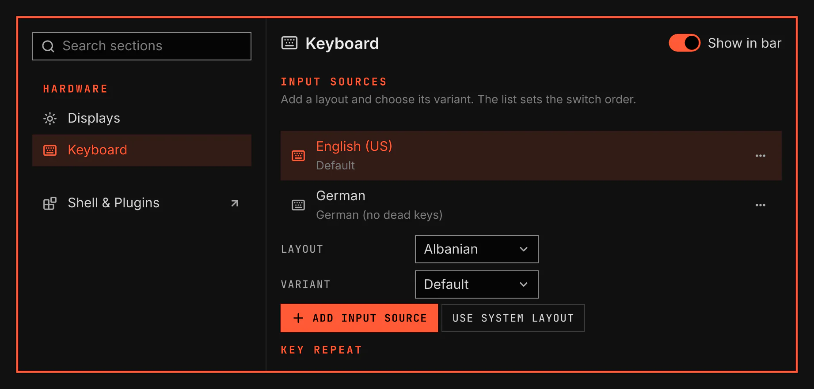

# Keyboard

Choose keyboard layouts, set their order, and adjust how a held key repeats.

Show command details

Screenshot made with `scripts/readme-shots.sh` from the System scene in the nested sandbox.

## Features

- Add input sources and choose their variants in System → Keyboard.
- Move a source with Ctrl+Up or Ctrl+Down. Delete removes the selected source.
- Open a source's menu with Shift+F10 to move or remove it.
- Try repeat rate and delay in the test field.
- Set modifier keys and Num Lock at startup.
- Click the layout code in the bar to switch to the next source. The code hides when you use one source.
- Open Keyboard Shortcuts to see and change VGS keys.

## Setup

Keyboard uses your system layout until you change the input sources. Use system layout restores it.
