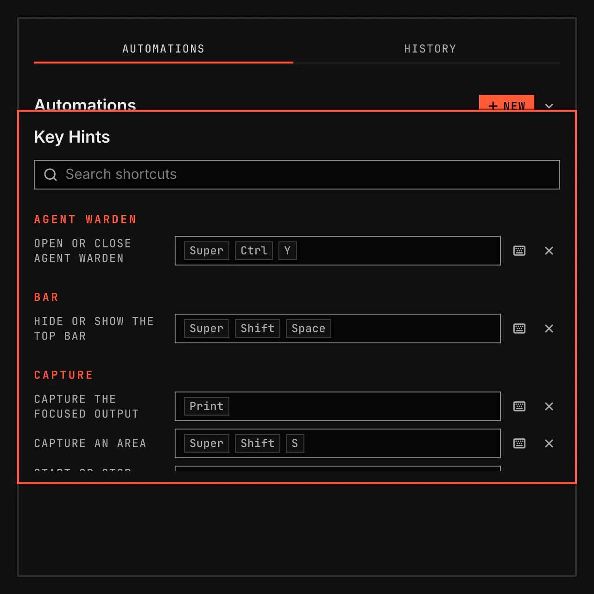

# Key Hints

See every shortcut VGS adds in one window, and change its keys there. Open it with `SUPER+/`.

Screenshot made with `scripts/readme-shots.sh` in the nested sandbox, with the default theme at scale 2.

## Features

- See the shortcut of every plugin that is on, grouped by plugin.
- Type to find a shortcut by its plugin, what it does or its keys.
- Change a shortcut or remove its keys.
- See when another plugin or one of your own Hyprland binds uses the same keys.

## The window

Key Hints opens on the focused monitor and fits on it. Each plugin that is on and has a shortcut has one section. Each row shows what the shortcut does and its keys. Typing goes to the search field and shows only the rows that match.

To change a shortcut, select its field and press the new keys. The keyboard button lets you type the keys instead. The change is saved at once. When VGS cannot save it, a line over the rows says why, in the same words as the Settings page, and the old keys stay. It is the same change as on the plugin's Settings page, and each place shows the other's keys. The remove button removes the keys, and the row stays so you can set new ones. The reset button on the plugin's Settings page restores the default keys.

Under a key, a line names each other plugin shortcut and your own Hyprland binds that use the same keys. It shows as soon as the window opens. It never stops you from setting the keys.

Escape closes the window while it has the keyboard. `SUPER+/` closes it too. Your close key closes it as for any other window.

## Developer interface

| Path | How |
|---|---|
| Shortcut | `vgs.keyhints:toggle`, `SUPER+SLASH` by default. |
| IPC | The host's `vgsh ipc call shell summon window vgs.keyhints '{}'`. The payload is `{}` or empty. Any other payload refuses the summon with `refused: open-failed=vgs.keyhints`. |

The window adds no store, key editor or conflict rule of its own. Its rows are the manager's plugin rows, the binds the Hyprland layer is written from. A key change goes through the manager to the plugin's `plugins[].keys` in `shell.json`. Each row is the `BindField` of `qs.Ui`, the bind row the Settings page's Keys row is built on, so both draw the key capture's conflict hint for the bind they name. A refused key reads as the shared reply line of `qs.Commons`, `Reply.line`, which the Settings page uses too.

A bind a plugin asks for while an earlier plugin by id holds the same keys has a row with the hint, and Hyprland does not bind it. An unbound shortcut has a row with no keys, and Hyprland does not bind it.

## Validation

`scripts/smoke/rows/keyhints.sh` opens the window with `SUPER+SLASH` in the nested sandbox. It reads the window's rows against the binds `hyprctl binds` reports with a `vgs.` description, and the hint under a default key that a harness Hyprland bind also uses, with no key press or click. It types on a row's key field and reads the rows filtered, sends a key the manager refuses and reads the refusal line and the unchanged `shell.json`, changes a key here and on the Settings page and reads the same `shell.json` value and the same hint in both places, unbinds a key and reads the window as an application window. Its control starts a copy whose window lists every plugin's binds and whose fields name no bind.
