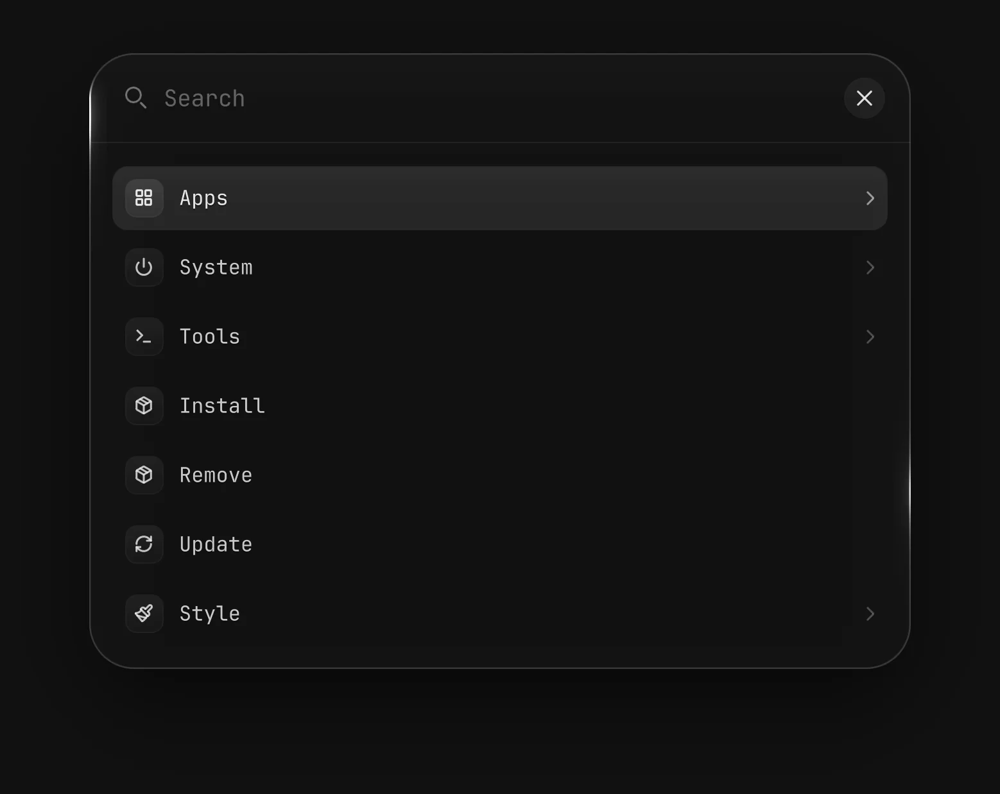

# Launcher

Launcher finds and opens apps, files and system actions from one search field. It is for anyone who wants to start things from the keyboard.

Screenshot made with `scripts/readme-shots.sh` in the nested sandbox, with the default theme at scale 2.

## Features

- Opens with `SUPER+SPACE`, or with a click on the magnifier in the bar.
- Finds an installed app or a menu row as you type.
- Finds a file with `f:` and a folder with `F:`. Enter opens it with its default app. Shift+Enter lists the apps that can open it, with Show in folder and Copy path.
- Shows the categories with Ctrl+B or the menu button.
- Offers Lock, Sleep, Hibernate, Log out, Reboot and Shut down under System.
- Offers Screenshot, Automations and New automation under Tools.
- Opens the Packages category from Updates, with Install, Update and Remove.
- Lists the rows other plugins add, such as the Style category from Themes.
- Shows a row as unavailable, and names the missing tool, when a tool it needs is not installed.
- Moves through the list with the arrow keys, Home, End, PageUp and PageDown. Escape clears the search, then leaves a menu, then closes the launcher.
- A right click on the bar magnifier offers Open terminal.

## Settings

The key is under Keys on the plugin's Settings page. The plugin has no other settings.
