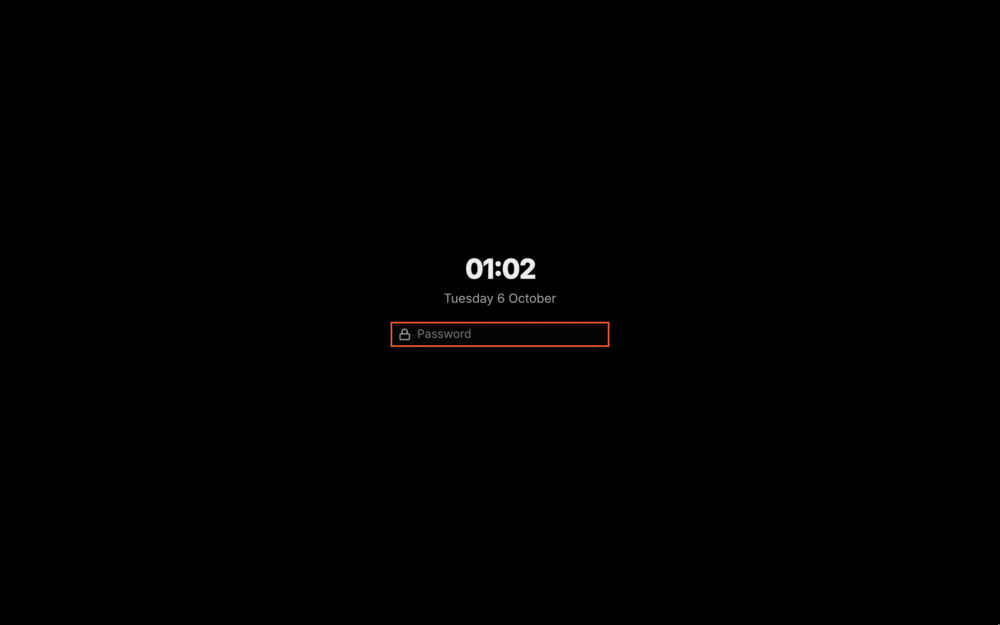

# Lock

Lock protects your session with your password. The lock screen uses the current theme and wallpaper. Your session stays locked if VGS stops or crashes.

Screenshot made with `scripts/readme-shots.sh` in the nested sandbox, with the default theme at scale 2.

## Install

The plugin ships with VGS and is enabled by default. Its password check needs no setup: the plugin carries its own PAM stack. Locking before sleep needs `systemd-inhibit`, `busctl` and `dbus-monitor`, which systemd and D-Bus provide. If one is missing, the shell's requirement notice installs it in one click, and the hook starts by itself once it is there.

## Features

- `SUPER+DELETE`, the launcher's Lock row and `vgshell lock` lock the session.
- The session locks after five minutes without input. A playing video that inhibits idle holds it off.
- The session locks before the machine suspends, and the suspend waits for the lock, for at most logind's delay.
- Every screen shows the time, the date and the password field; typing on any screen fills every field.
- Ten wrong passwords pause the check for two minutes, and the lock screen tells you to wait.
- If another lock screen already holds the session, the lock takes it over, as Hyprland allows under VGS's settings. If that other lock screen then unlocks the session, the Settings page warns, and the next lock works again.
- If a suspend goes ahead before the lock is confirmed, a warning toast tells you once you are back at the desktop.
- After a crash while locked, `vgshell run` starts the shell again, and the new shell locks the session again with its own lock screen.

## How it works

1. A lock request asks the shell's core for the one session lock. The core draws this plugin's lock screen on every screen, and Hyprland confirms the lock.
2. Enter checks the password through PAM with the plugin's `pam/vgs-lock` stack, which is Omarchy's lock stack. Nothing is checked until you press Enter.
3. A correct password unlocks. Disabling or updating the plugin while locked keeps the session locked, and the lock screen comes back with the plugin.
4. The shell keeps a logind delay on every suspend while it runs. When logind announces a suspend, the plugin locks and lets the suspend go once Hyprland confirms the lock.
5. When a shell starts, the plugin asks Hyprland whether a session lock is still held by a lock screen that is gone, and locks again if so.

If the shell dies while locked, Hyprland keeps the session locked and shows its own warning screen. The lock screen returns the next time the shell starts.

## Settings

- **Lock when inactive**: time without input before the session locks; 0 disables locking when inactive.
- **Lock before sleep**: hold each suspend until the session is locked.
- The key: the Settings window's Keys section for Lock, or `plugins[].keys.lock` in `~/.config/vgshell/shell.json`.

`vgshell lock` locks the session from a user script, an idle daemon or a lid-switch bind.
