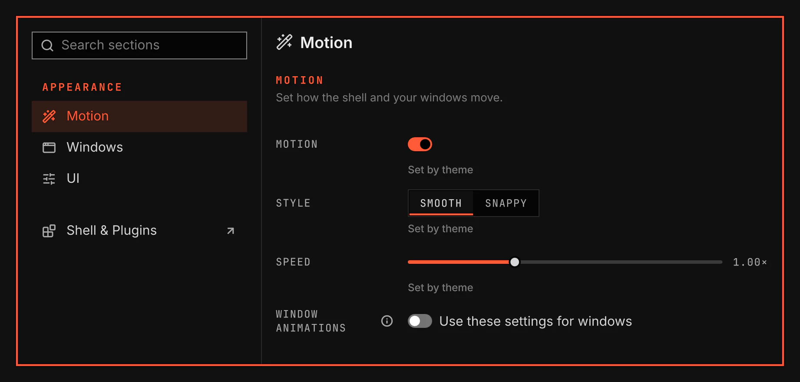

# Motion

Motion sets how the shell and your windows move. It is for anyone who wants faster, slower or no animations.

Screenshot made with `scripts/readme-shots.sh` in the nested sandbox, with the default theme at scale 2.

## Features

- A Motion section under Appearance in the System Settings window.
- Each value shows Set by theme until you change it. Use theme value puts the theme's value back.
- Motion, Style and Speed apply to the shell. They apply to your windows too while Window animations is on.
- Window animations is off at first, so Hyprland keeps the window animations from your own Hyprland config. While it is on and your config sets another value, the row shows that value and offers Use my Hyprland value.
- The values stay in effect when you disable this plugin. Enable it again to change them.

## Values

| Value | What it changes |
| --- | --- |
| Motion | Turns all animations on or off. |
| Style | Smooth or Snappy: how each animation slows at its end. |
| Speed | How fast animations play, from 0.5× to 2×. |
| Window animations | Moves your windows with the Motion, Style and Speed above. |
