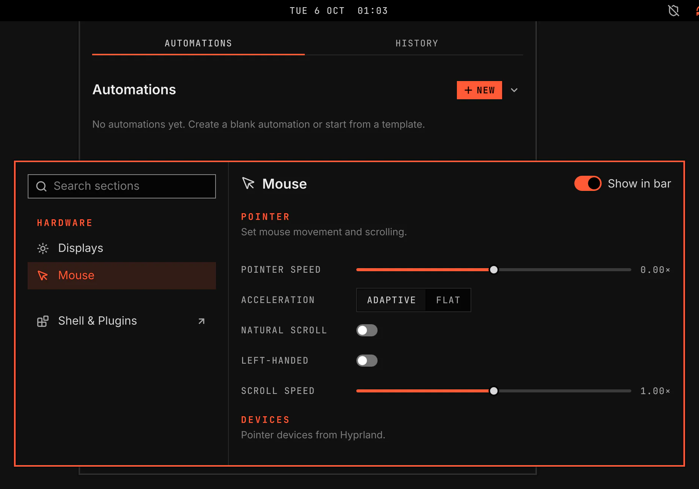

# Mouse

Mouse sets pointer speed, scrolling and touchpad options. It adds a bar icon with a flyout and a Mouse section in the System window.

Screenshot made with `scripts/readme-shots.sh` in the nested sandbox, with the default theme at scale 2.

## Features

- A bar icon that opens the Mouse flyout.
- A flyout with pointer speed, natural scroll, the touchpad switch when a touchpad exists and Mouse Settings.
- A Mouse section in the System window with pointer settings, touchpad settings, device rows and a try-it area.
- Overridden rows show when your Hyprland config changes a value after the VGS loading line.

## Settings

| Setting | What it does |
|---|---|
| Pointer speed | Sets pointer sensitivity from -1× to 1×. |
| Acceleration | Chooses adaptive or flat pointer acceleration. |
| Natural scroll | Moves content in the same direction as your fingers. |
| Left-handed | Swaps the main and secondary mouse buttons. |
| Scroll speed | Sets wheel scroll speed from 0× to 2×. |
| Touchpad | Turns the touchpad on or off. |
| Tap to click | Uses a tap as a click. |
| Disable while typing | Ignores touchpad movement while you type. |
| Two-finger right-click | Uses a two-finger click as right-click. |
| Touchpad scroll speed | Sets touchpad scroll speed from 0× to 2×. |

## How it works

Mouse declares Hyprland input options in its manifest. The core writes those options into the VGS Hyprland layer only after you change a setting. The plugin never runs `hyprctl`.

The device list comes from Hyprland through the core. No device node is opened.

## Keys

The bar takes no keyboard focus. Open System, type "mouse" and press Enter. In the section, Tab moves between controls, arrow keys change sliders and segmented controls, Space changes switches and Escape returns to the sidebar.

## Validation

`scripts/test-mouse-logic.js` holds the option map and the Mouse decisions, with controls. `scripts/smoke/rows/mouse.sh` runs Mouse in the nested sandbox and checks option writes, untouched defaults, overridden badges, the no-touchpad view, the flyout and the keyboard path.
