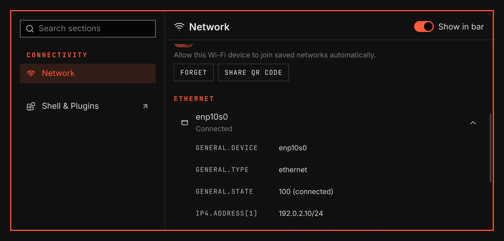

# Network

Network shows Wi-Fi and Ethernet connections in the bar, a flyout and the Network section of System.

Image: `scripts/readme-shots.sh`.

## Features

- Join Wi-Fi with a saved password or a masked password field.
- Enter the password again when a saved password fails.
- Forget saved networks and control the Wi-Fi radio.
- Share a saved network through its Share QR code menu entry.
- Change automatic joining for the Wi-Fi device.
- Show Ethernet state and connection details.

## Use

Open Network from its bar icon or the System window. Select a network and press Enter to join or disconnect. Delete forgets the selected saved network. Network settings opens its System section.

Network uses NetworkManager. If NetworkManager is absent, stopped or refuses access, Network shows the cause. VGS does not switch your network service. Wi-Fi passwords stay in NetworkManager's store.

Share QR code reads the chosen saved profile only after you select it. The QR code closes when you press Close QR code, close Network or lose the network. VGS keeps neither the saved password nor the QR code after the view closes. An enterprise network uses its provider's setup and cannot use a password QR code.

Connection details and sharing use installed tools. The Network section offers Install details tool when its reader is missing. Share QR code opens the installation notice if a sharing tool is missing. Package installs include both tools.

## Omarchy comparison

VGS follows Omarchy's Network model and Wi-Fi QR plugin at commit `5c4da021469517449770579793b37ce26d0a0d48`: saved-profile joining first, reprompt after failed credentials, and a QR encoder that takes its Wi-Fi payload through stdin. One VGS service owns scanning for all open Network views. The QR owner exists only while its view is open and has no password reveal or clipboard action. Band preference and adapter restart are outside this Network scope. A band preference needs a saved-profile editor; an adapter restart needs a declared privileged system step. Network uses the existing backend without replacing it.
