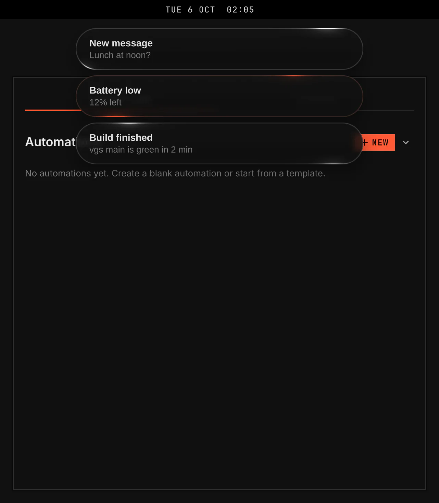
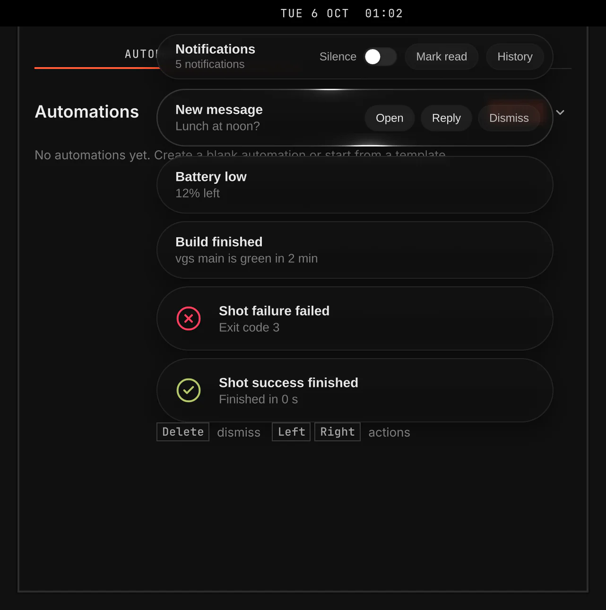

# Notifications

Notifications shows application notifications at the top of each screen and keeps them in a panel to read later. Silence keeps new notifications in History without showing them on screen.





Screenshots come from `scripts/readme-shots.sh` in the nested sandbox, with the default theme at scale 2. VGS uses a summoned panel to give the list keyboard focus.

## Features

- Super+N opens and closes the panel. Escape closes it too.
- Unread shows the notifications received since the last Mark read. History shows the saved ones.
- Mark read marks the current notifications as read and closes the panel. Clear history removes the saved ones.
- Silence keeps new notifications in History without showing them on screen.
- A normal notification stays on screen for at least the Notification duration. A critical one stays until closed. Pointing at a notification pauses its timer.
- Pointing at a notification shows its actions. A click runs its main action, such as View in Slack, and brings the application's window into view. An action removes the notification from the screen and from the panel. Dismiss, or a right click, removes it from the screen.
- Enter opens the selected notification in the panel. Delete dismisses it.
- A file notification opens the file in your editor, or in the default app for the file.
- Slack notifications show sender initials and workspace icons without setup. Custom emoji appear when Slack has saved their images. See [Slack notifications](slack.md).
- The panel says so when the saved history cannot be read. Clear history starts a new one.

## Settings

| Setting | What it changes |
| --- | --- |
| Notification duration | The minimum time a normal notification stays on screen. |
| Slack custom emoji | Whether custom emoji show in Slack notifications. |

The key is under Keys on the plugin's Settings page. The Requirements section lists the tools that open notification files and prepare Slack icons and emoji, with Install all missing.

## Extras (not supported)

These features need developer setup. They are off by default and do not appear in Plugins. They are kept for the owner and are not supported. See [D075](../../../docs/decisions/D075-consumer-features-need-no-developer-setup.md).

- **Slack photos**, `slackPhotos`: sender photos and cached workspace icons from a Slack app user token per workspace, and custom emoji from Slack's emoji list. `{ "id": "vgs.notifications", "slackPhotos": true }` in `plugins` in `~/.config/vgshell/shell.json` turns it on. The Settings page then lists a Slack tokens row with Connect for each workspace, and `curl` and `secret-tool` under Requirements. With it off, the plugin reads no token, calls no Slack API, removes the photos it cached and shows no token row. An install that had Slack photos before they became an extra keeps them: a one-time migration turns the extra on when a Slack token is stored ([distribution.md § Migrations](../../../docs/architecture/distribution.md#migrations)).

With no token, or with no `secret-tool` binary installed, Slack notifications keep the initials faces and the workspace icons above.

Each workspace takes its own token, in libsecret under `service vgs-notifications` and `account slack:<team id>`, the team id Slack's workspace list gives it. The Settings page lists each workspace the list names, with its token's state: Present, Absent, Locked or Unavailable. **Connect** opens a masked field for the workspace's token. VGS stores it in your keyring through `secret-tool`, handing it over on stdin, never on a command line, and the photos load at once. **Disconnect** removes a stored token. The check runs at start, when the workspace list changes, after each Connect or Disconnect and after each photo refresh; it never reads a token or unlocks the keyring.

A token is a Slack app's user token (`xoxp-`) with the user token scopes `users:read` and `team:read`, and `emoji:read` for custom emoji, installed to the workspace. The single-workspace token of earlier versions, `account slack`, still works for the one team its `team.info` names, unless that team has its own token.

<details><summary>Show command</summary>

```bash
secret-tool store --label='VGS notifications Slack token' service vgs-notifications account slack
secret-tool store --label='VGS notifications Slack token T0ACME' service vgs-notifications account slack:T0ACME
```

</details>

The helper calls `team.info` and `users.list`. It stores only the team id, team names, the team icon, each user id, each user's display name, real name, Slack name and `image_48` photo, under `$XDG_CACHE_HOME/vgshell/notifications/slack-photos/`. It does not read or store messages, channels, presence, email, profile text or tokens. [secrets.md](../../../docs/architecture/secrets.md) holds the cache, its refresh and its limits.

Developer details: [Developer reference](developer.md).
