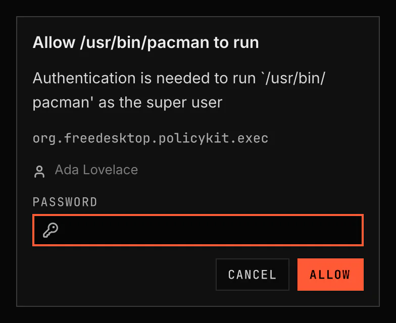

# Polkit

Polkit asks for your password when an application needs administrator access. The prompt uses the current theme.

Screenshot made with `scripts/readme-shots.sh` in the nested sandbox, with the default theme at scale 2.

## Install

The plugin ships with VGS and is enabled by default. Only one app at a time can show password prompts. When another app shows them, the Settings page names it and offers a button to remove or stop it.

## Features

- A dialog over a dimmed screen with the request's message and its polkit action, the account it authenticates as, and the password field.
- A choice of account when the request accepts several, such as every member of an administrators' group. Tab and Shift+Tab reach it from the keyboard.
- Enter or Allow submits the password. Escape or Cancel denies the request.
- A wrong password, and every message PAM sends, shows under the field; the dialog then asks again.
- The Settings page shows whether VGS can show password prompts.
- When another app shows password prompts, the Settings page names it. Uninstall removes that app. When another installed app needs it, the button is Stop: VGS stops it in each session and leaves it installed.
- When polkit is not installed, the Settings page offers Install.
- After Uninstall, Stop or Install, VGS shows password prompts at once. You do not log in again.

## How it works

1. The shell registers the agent with polkitd while this plugin is enabled.
2. An application asks polkitd for an action; polkitd hands the request to the agent.
3. The plugin shows the dialog on the focused screen. Your password goes to PAM through polkit's helper and is cleared from the field at once.
4. The dialog closes when the request succeeds, fails for good or is cancelled.
