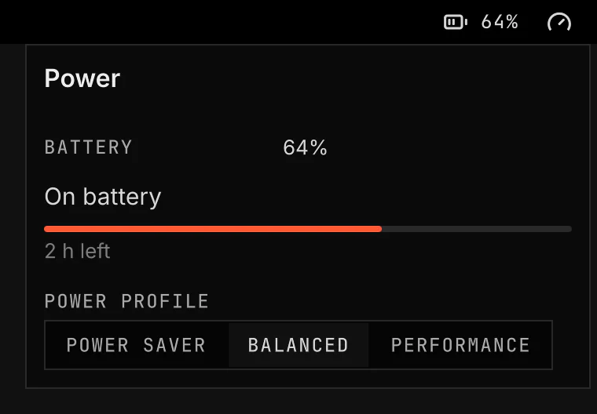

# Power

Screenshot made with `scripts/readme-shots.sh` in the nested sandbox, with the default theme at scale 2, over the sandbox's fake battery.

## Features

Power shows the laptop battery level in the bar. It also shows the active power profile on laptops and desktops.

The flyout shows the battery level, the charging state, the time estimate and the available power profiles.

## Settings

- Low battery alert: sends a normal alert when the battery falls to this level while discharging.
- Critical battery alert: sends an urgent alert when the battery falls to this level while discharging.
- When charging: sets the profile after you connect power.
- On battery: sets the profile after you disconnect power.

## How it works

Power reads UPower and the power profile service through Quickshell's UPower service. It does not run a command to set the power profile.

The plugin applies a remembered profile only after the power source changes while VGS is running. It does not change the profile when VGS starts.

A battery alert fires once per threshold during one discharge. A threshold becomes available again after the battery stops discharging. If VGS first sees the battery below both thresholds, it sends only the critical alert.

The Performance choice is unavailable on hardware that power-profiles-daemon says has no performance profile. VGS does not save a different profile when that write is refused.

On a desktop, the battery part stays hidden and the profile icon remains visible. If profile control is unavailable too, the bar item hides.

## Requirements

Power needs the power profiles service on the system bus. power-profiles-daemon and tuned-ppd provide it.

Power needs `notify-send` from libnotify to send battery alerts.

## Validation

- `node scripts/test-power-logic.js`
- `.agents/skills/vgs-plugin/scripts/vgs-plugin check shell/plugins/vgs.power`
- `scripts/validate`
- `scripts/qml-smoke.sh --rows device-fakes,power`
