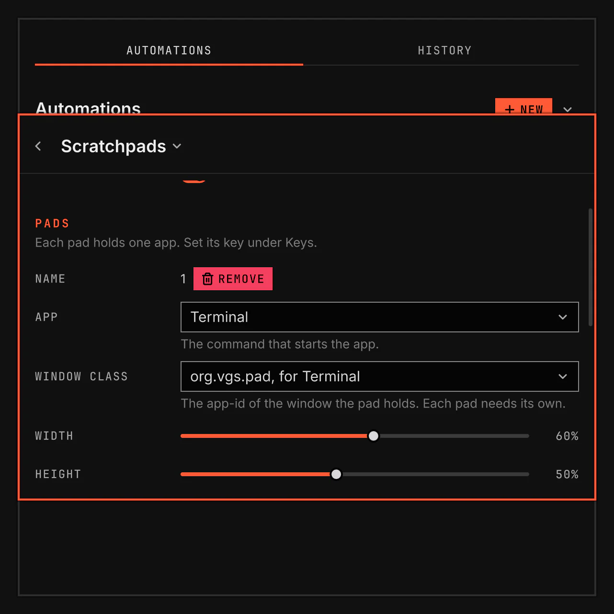

# Scratchpads

Scratchpads shows and hides an app with one key, over whatever you work on. Each pad holds one app at the size, place and screen you set in Plugins.

Screenshot made with `scripts/readme-shots.sh` in the nested sandbox, with the default theme at scale 2.

## Features

- Add, change and remove pads on the Scratchpads page in Plugins. No file to edit.
- Give each pad its own key under Keys.
- A press starts the app when it is not running, then shows it once its window is open. An empty pad never shows.
- Set the size as a share of the screen, so one setting fits a laptop panel and a large display.
- Put the pad in the centre, at an edge or in a corner, with a margin.
- Choose the side it comes in from, and whether it slides, fades or appears at once.
- Open it on the focused screen or on one screen you choose.
- Start its app at login, so the first press shows it at once.
- Click anywhere beside the pad, or move to another window, to hide it.
- Remove a pad, or turn off Scratchpads, and its app comes to the workspace you are on.

## Settings

| Setting | What it changes |
| --- | --- |
| App | The command that starts the app. Terminal, Second terminal and Third terminal open your default terminal, each with its own window class. Custom takes any command. |
| Window class | The app-id of the window the pad holds. The app must open its window with this class. Each pad needs its own. |
| Width, Height | The pad's size, in percent of the screen's free area. |
| Position | Where the pad sits: the centre, an edge or a corner. |
| Margin | The space between the pad and the screen edge it sits at, in percent of the shorter side of the screen's free area. |
| Comes in from | The side the pad slides in from and back out to. |
| Motion | Slide, fade or none. |
| Screen | The screen the pad opens on: the focused one, or one by name. |
| Start at login | Starts the app when VGS starts, hidden. |

A new pad has no key. Set one in the Keys section of the same page.

A new pad takes the Terminal choice and its window class. For a second terminal pad, pick Second terminal and its class. While two pads share a window class, the later one opens nothing, and its key shows a message that says so. An app that opens its window with another class than the pad names is never shown. After 15 seconds a message says so.
