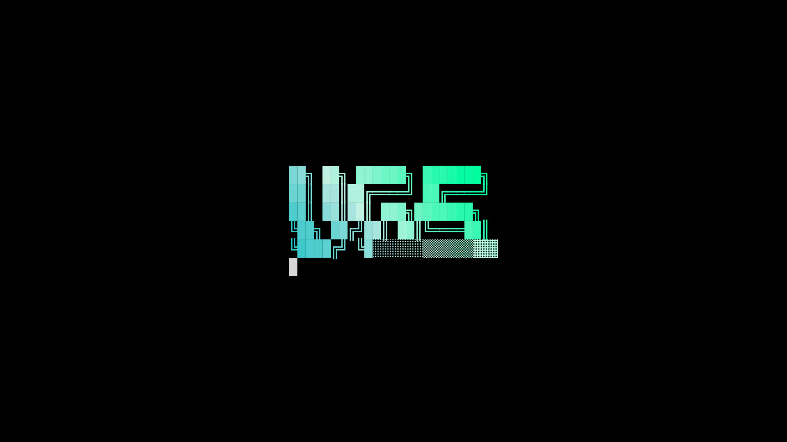

# Screensaver

Screensaver shows animated text art when the desktop is inactive. You can also start it from the launcher.

Screenshot made with `scripts/readme-shots.sh`.

## Features

- Starts after the inactive time you choose.
- Runs one cover on each screen.
- Starts on demand from the launcher.
- Stops on keyboard input, pointer movement or session lock.
- Lets you choose the text effect when the effect tool reports its list.
- Lets you change the art from an image, text edit or reset.
- Shows whether the lock follows after the screensaver.

## Settings

- Start when inactive: turns the idle start on or off.
- Start after: sets the idle time in seconds. The screensaver time and lock time both count from the start of inactivity.
- Effect: selects Random or one named effect.
- Frame rate: sets how often the screensaver draws a new frame.
- Change art: opens a setup window with From image, Edit text and Reset.
- Keys: Screensaver starts the cover on demand. It has no default key.

## Licence

MIT. See `ATTRIBUTION.md` for the notice carried by the related scripts.
