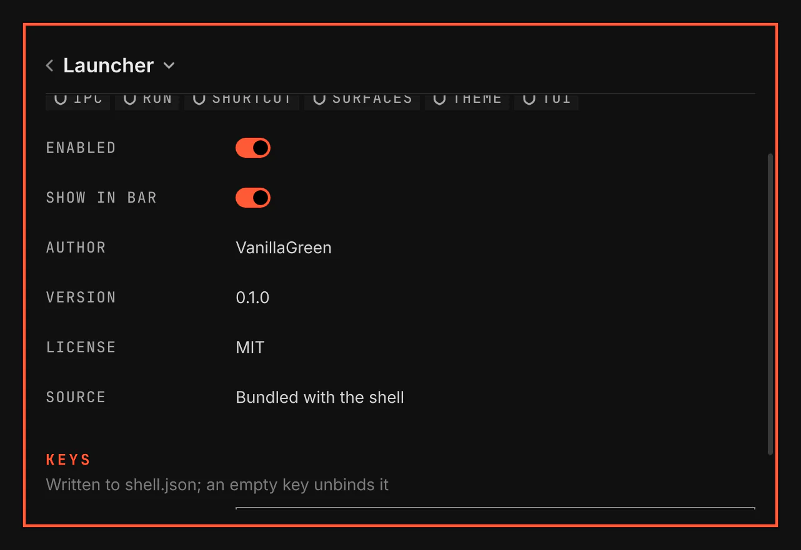

# Plugins

Plugins is the window where you manage your plugins, their settings and their shortcuts. Open it with `SUPER+M`, the plug in the bar, or Settings > Plugin settings in the launcher. Plugins is always on.

Screenshot made with `scripts/readme-shots.sh` in the nested sandbox, with the default theme at scale 2.

## Features

- Search for a plugin and open its page.
- Turn a plugin on or off. Plugins itself stays on.
- Show a plugin in the bar, or take it out while its other features stay on.
- Change a plugin's settings. Under Keys, select a shortcut and press its new keys. Use my binding keeps one of your own Hyprland binds on the same keys.
- Read a plugin's status under Details. Install all missing installs its missing tools. Connect stores an account key in your keyring behind a masked field.
- Add a plugin from its git address, update it with its changes shown first, or remove it.
- Escape returns to the list, then closes the window.
