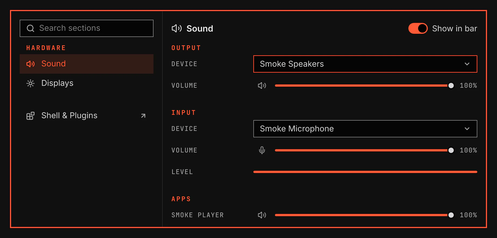

# Sound

Sound sets the volume, the output and input device, and the volume of each app that plays. It adds a bar icon with a flyout, a Sound section in the System window, the volume keys and an on-screen display.

Screenshot made with `scripts/readme-shots.sh` in the nested sandbox, with the default theme at scale 2, over the sandbox's own PipeWire and its null devices.

## Features

- A bar icon that shows the output level. A click opens the flyout, the mouse wheel changes the volume and a middle click mutes the output. The tooltip names the output and its level.
- A flyout with the output device and its volume, the input device and its volume, and one volume for each app that plays. Sound settings opens the System window on the Sound section.
- A Sound section in the System window with the same controls and a level meter for the input.
- The volume keys raise, lower and mute the output, and mute the microphone. Each shows an on-screen display on the screen you use. Change a key under Keys on the plugin's Settings page.
- Choosing an output makes it the default. The apps that play now move to it.
- While PipeWire is not running, the bar icon shows a crossed speaker. Sound connects again when PipeWire starts.

## Settings

| Setting | What it changes |
| --- | --- |
| Volume step | How much the volume keys and the mouse wheel change the volume: 2%, 5% or 10%. |

Moving the apps that play needs `pactl`. The Playing apps row on the plugin's Settings page installs it when it is missing. Without it, new apps use the new output and the apps that play now stay where they are.
