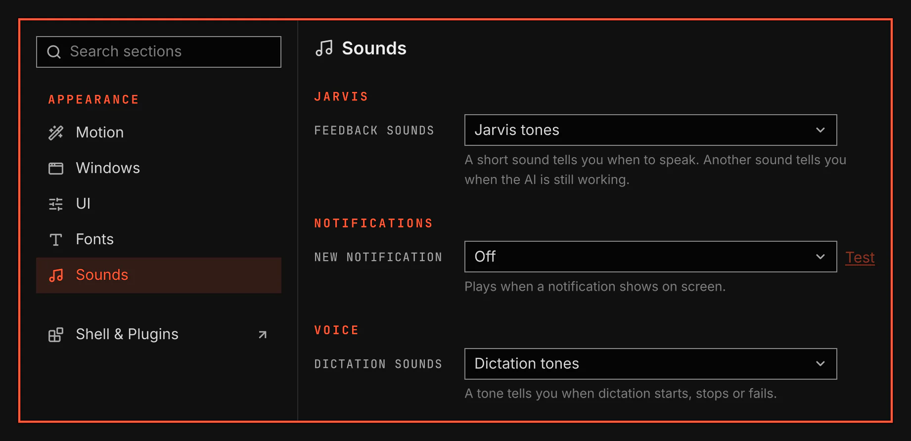

# Sounds

Sounds sets the sound of each event a plugin has, such as a new notification or the dictation tones. It is for anyone who wants other sounds, or none.

Screenshot made with `scripts/readme-shots.sh` in the nested sandbox, with the default theme at scale 2.

## Features

- A Sounds section under Appearance in the System Settings window.
- The section lists the events of every enabled plugin under the plugin's name.
- Each event has a list of sounds. Off turns the event's sound off.
- A sound plays when you choose it. Test plays it again.
- Jarvis and dictation play their own tones, so each of those events offers Off and its own tones only.
- Dictation sounds shows the value your voxtype config holds. A change there restarts voxtype.
- Your choices stay in effect when you disable this plugin. Enable it again to change them.
