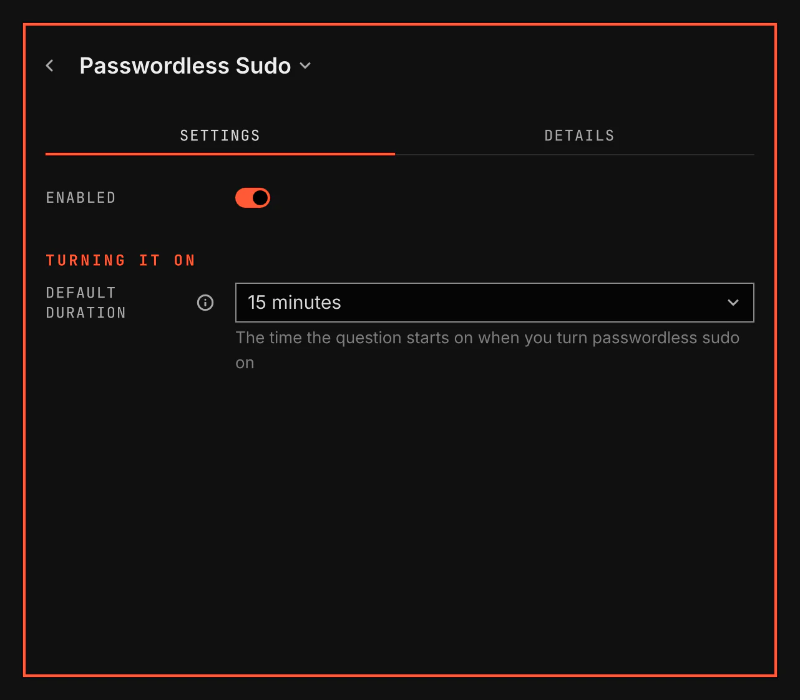

# Passwordless Sudo

Passwordless Sudo puts a lock in the bar. Click it to turn passwordless sudo on for a time you choose, and click it again to turn it off.

Images come from `scripts/readme-shots.sh` in the nested sandbox.

While it is on, any program running as you can run anything as root without a password.

## Features

- A closed lock while passwordless sudo is off. An open lock in the warning colour while it is on. The tooltip tells until when.
- A question mark when VGS cannot read whether it is on. On NixOS, a snowflake: your system configuration holds the rule, and VGS cannot read it.
- Click the closed lock to turn it on. A terminal opens and asks how long: 15 minutes, 1 hour, 1 day or Indefinitely, starting on your default. It shows the risk and asks you to confirm. Indefinitely asks a second time.
- The first time, the same terminal also sets up the part of passwordless sudo that runs as root. Sudo asks for your password once.
- A timed grant ends by itself at its time, and at the next restart if the computer restarts first.
- Indefinitely stays on, also after a restart, until you turn it off.
- Click the open lock to turn it off. It asks nothing, and its terminal closes by itself.
- A notification each time you turn it on or off. The notification for on tells how long it stays on.

## Settings

| Setting | What it changes |
| --- | --- |
| Default duration | The time the question starts on when you turn passwordless sudo on: 15 minutes, 1 hour, 1 day or Indefinitely. |
