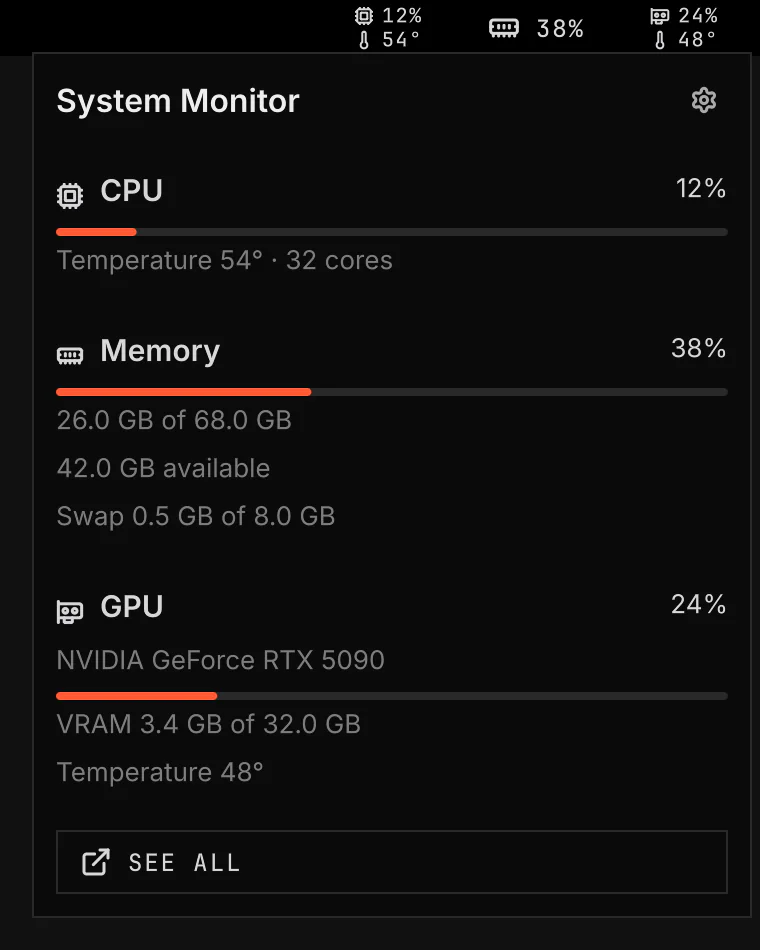

# System Monitor

System Monitor shows CPU, memory and graphics card use in the bar. Its flyout shows temperatures, memory totals and graphics memory.

Image: `scripts/readme-shots.sh`.

## Features

- Choose the readings in the bar.
- Add CPU and graphics card temperatures.
- Show memory as a percentage or used GB.
- Open the flyout for memory, swap and graphics memory details.
- Open See all for the process list in btop.
- Show unknown readings as `--`.
- Show a sleeping graphics card as Asleep in the flyout.

## Settings

Open Settings, Shell & Plugins, System Monitor. CPU, Memory and GPU each turn their bar value on or off and hold its options. Graphics card, under GPU, selects the card when the computer has more than one. Readings sets the refresh interval and the temperature unit. Labels shows an icon or a short name before each reading. Layout shows two readings of one item, such as CPU use and temperature, on one line or stacked on two short lines.

If See all is missing, select Details on the same page. In Requirements, select Install all missing to add btop for the process list.
