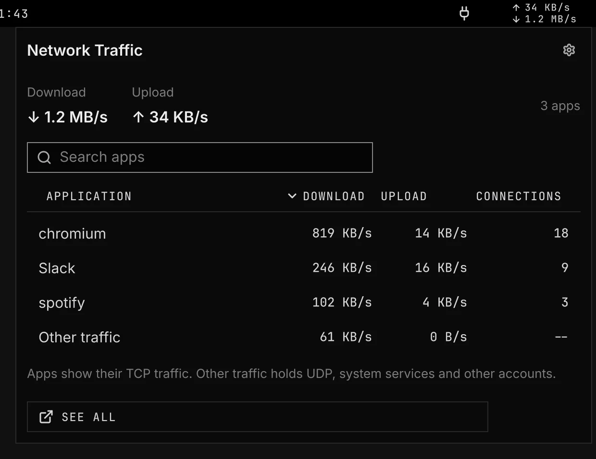

# Network Traffic

See download and upload speeds in the bar. Click the widget to see traffic per app.



- Choose download, upload, or both speeds in the bar.
- Stack the upload speed over the download speed on two short lines.
- Search apps and sort their download, upload, or connection count.
- Click an app to inspect its processes and connections, or to kill it. Kill asks first and names the app and its processes.
- See traffic from other accounts and protocols in Other traffic.
- Open the complete traffic view with See all.

## Setup

Open Settings > Plugins > Network Traffic to change the speeds shown, the layout, the decimals each speed shows, and the refresh interval. By default, KB/s shows no decimals and MB/s shows one. Apps show TCP traffic from your account. Other traffic includes UDP, system services, and other accounts.

The optional bandwhich requirement enables See all. Install it from the Requirements section. The Traffic capture row has Allow when capture access is needed. Allowing it lets every account on this computer see network traffic through bandwhich.

A package update can remove capture access. Close Settings, then open Settings > Plugins > Network Traffic to check access again. The Traffic capture row shows Allow if access is needed.

<details>
<summary>Show command</summary>

The image comes from `scripts/readme-shots.sh` in the nested sandbox.

The core system step grants capture access to the trusted installed binary:

```sh
setcap cap_sys_ptrace,cap_dac_read_search,cap_net_raw,cap_net_admin+ep /usr/bin/bandwhich
```

The See all terminal runs:

```sh
bandwhich
```

</details>

## Licence

[MIT](../../../LICENSE)
