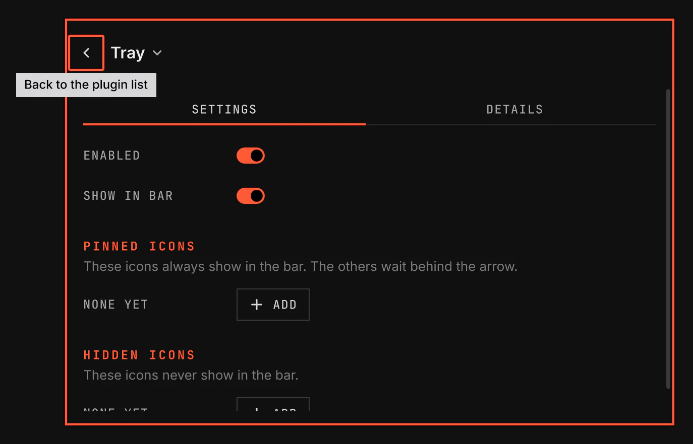

# Tray

Tray shows the tray icons of your apps in the bar, such as chat, sync, VPN and media apps. Click an icon to open the app, and right-click it to use the app's menu.

Images come from `scripts/readme-shots.sh` in the nested sandbox.

## Features

- Every app that shows a tray icon, in the bar.
- A drawer behind the arrow holds the icons. Rest the pointer on the arrow to open it, or click the arrow to keep it open.
- Pinned icons always show next to the arrow. Hidden icons never show.
- Left-click an icon to open its app. Middle-click it for the app's second action. Scroll on it to change what the app changes, such as its volume.
- Right-click an icon to open the app's menu. An entry with an arrow opens its submenu in the same menu, and Back returns to the level above.
- Right-click the arrow and choose Manage tray icons to pin or hide each icon. The same menu hides the whole tray.

## Settings

| Setting | What it changes |
| --- | --- |
| Pinned icons | The apps whose icons always show in the bar. |
| Hidden icons | The apps whose icons never show in the bar. |

Pin and Hide in Manage tray icons change the same two lists. An app that is not running keeps its place in each list.

## Licence

Parts of Tray are adapted from Omarchy under the MIT licence. [LICENSE](LICENSE) names the files.
