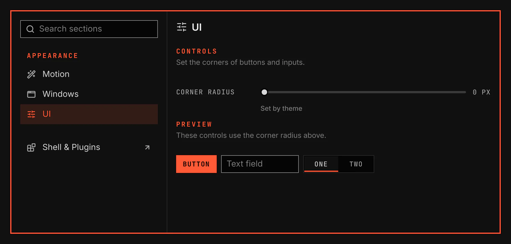

# UI

UI sets the corner radius of buttons, text fields and segmented controls. It is for anyone who wants rounder or squarer controls than the theme gives.

Screenshot made with `scripts/readme-shots.sh` in the nested sandbox, with the default theme at scale 2.

## Features

- A UI section under Appearance in the System Settings window.
- The value shows Set by theme until you change it. Use theme value puts the theme's value back.
- A preview shows a button, a text field and a segmented control with the radius. Bar items and checkboxes keep the theme's radius.
- The value stays in effect when you disable this plugin. Enable it again to change it.

## Values

| Value | What it changes |
| --- | --- |
| Corner radius | The corners of buttons, text fields and segmented controls, from 0 to 16 px. |
