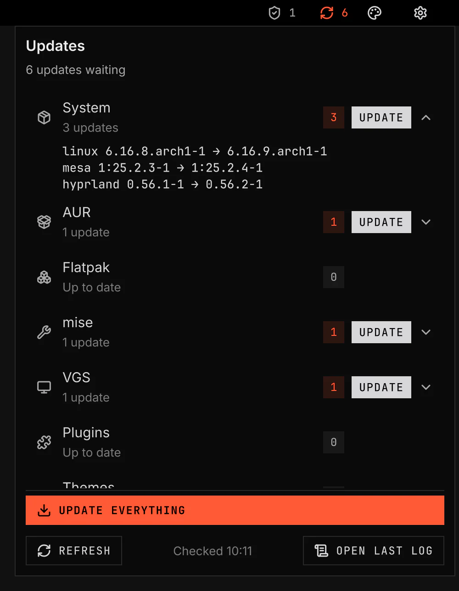

# Updates

Updates checks your system, VGS, plugins, themes and developer tools. Open its bar button to view available updates and install them.



Screenshot made with `scripts/readme-shots.sh` in the nested sandbox, with the default theme at scale 2.

## Sources

The service runs this command with argv only:

```text
bin/check --vgsh <absolute path to vgsh>
```

`bin/check` refuses when `--vgsh` is missing or is not an executable absolute path.

The script holds this lock for the whole check:

```text
${XDG_RUNTIME_DIR}/vgs/updates/check.lock
```

It starts these read-only commands concurrently, each in its own process group:

- `vgsh pkg check --json`: system packages, AUR, Flatpak and mise tools.
- `vgsh self status --json`: the VGS checkout, package, Nix install or curl install.
- `vgsh plugin outdated --json`: installed plugin git checkouts.
- `vgsh theme outdated --json`: installed theme git checkouts and catalog installs.

TERM, INT or HUP to `bin/check` sends TERM to every probe's process group and waits for each probe to exit. A probe starts with SIGINT ignored, as every background job of a shell without job control does, so TERM is the signal each probe acts on. A probe ends its own git fetch before it exits: [manager.md § Outdated](../../../docs/architecture/manager.md#outdated).

It writes this file atomically:

```text
${XDG_STATE_HOME}/vgs/updates/status.json
```

The status file has this shape:

```json
{ "checkedAt": 1790650695194, "sources": [], "error": null }
```

`checkedAt` is whole milliseconds since the Unix epoch.

`sources` is a list of source rows.

Each row is `{ source, label, count, packages, checkedAt, error }`.

A failed source stays visible with `count: null` and its reason in `error`.

The shared status value bounds `packages` to twelve rows per source.

A shared source row adds `more` with the number of package rows omitted.

Package `name`, `old` and `new` text is cut to eighty characters in shared status.

The full package list stays in `status.json`.

`error` is null in every file `bin/check` writes: each probe's failure is its own source row. A check that fails before it writes leaves the last good file unchanged, and the service reports that failure in `checkState`. The service still reads a non-null `error` as a failed check.

## Counts

Package-manager rows count packages.

VGS counts as one update when `vgsh self status --json` reports `behind: true`.

Plugins and themes count one update per checkout or catalog package that is behind.

Their package rows keep the commit count as `behind` for the flyout.

An installed directory that is not its own git checkout, such as a copied plugin, has no upstream and `vgsh plugin update` refuses it too, so it is not an update source and is left out.

A checkout whose fetch failed names itself in the source's `error`; the other checkouts still count.

## Cadence

The default check interval is six hours.

The service publishes the cached snapshot at startup.

It checks at startup only when the cache is older than the interval.

It schedules the next check from `checkedAt`.

It accepts `vgsh ipc call vgs.updates invoke check ''` for an on-demand check.

It checks again when one of its own TUI runs records a new end in `shell.tui.state` after the service started. A service rebuilt after a run does not check again for it.

A cache older than twice the interval reports a stale check state.

A check process failure keeps the last good snapshot and reports a danger state.

After a process failure, the service retries after five minutes.

Only one check process runs at a time.

A second request while a check runs queues one more check.

## Status values

The service publishes these status keys:

- `pending`: total updates with numeric counts.
- `lastCheck`: the last successful snapshot time.
- `checkState`: `ok`, `info`, `warning` or `danger`, with a short reason.
- `checking`: whether a check process runs. It is the widget's spinner, since `info` also means "not checked".
- `sources`: the source rows for the bar widget and the flyout.

The Settings page shows the first three rows as read-only status.

`checking` and `sources` are data for the widget and the flyout.

## IPC

`check` starts a check.

It returns `started` or `queued`.

The flyout's Refresh reaches the same handler through `shell.ipc.call("check", "")`, so the service stays the one owner of every probe.

`status` returns the values currently published through plugin status.

## Privacy and network

The service does not send data itself.

The commands it runs can touch the network:

- `vgsh pkg check --json` can use `checkupdates`, Flatpak remotes and mise registries.
- `vgsh self status --json` can fetch the VGS upstream or query the GitHub release API.
- `vgsh plugin outdated --json` fetches installed plugin git upstreams.
- `vgsh theme outdated --json` fetches installed theme git upstreams.

The shell never elevates for a check.

## Omarchy comparison

Omarchy's `SystemUpdate.qml` checks at startup, every six hours and after an update run.

VGS uses the same cadence.

Omarchy checks only whether Omarchy itself has an update.

VGS counts every source because the badge represents the whole system.

## Bar widget and flyout

The widget and the flyout read the status values alone. `UpdatesLogic.js` decides what each draws, and neither runs a check.

The widget has five states:

| State | When | Draws |
|---|---|---|
| Current | The last check succeeded and nothing waits. | The calm `refresh-cw` icon in the bar's colour, with no badge. |
| Pending | The last check succeeded and updates wait. | The icon and a count badge in the accent tone. |
| Attention | The check failed, a source failed, or the snapshot is older than twice the interval. | The `triangle-alert` icon and the count in the warning tone. |
| Checking | A check process runs. | A spinner in place of the icon, with the last count. |
| Unchecked | No check has published a state yet. | The calm `circle-dashed` icon. |

The count badge shows at most `99+`.

The tooltip lists the state, each source's count and the time of the last check.

A left click opens or closes the flyout under the widget. The global shortcut `vgs.updates:toggle`, bound to `SUPER+CTRL+U` by default, opens the same flyout at the plugin's `placement`. A middle click opens the `update` TUI for every source; the flyout's Update everything button is its keyboard path.

The flyout has one row per source, in the order the service publishes them. It opens with keyboard focus on the first source row. Each row shows its count badge and its error, if it has one. A source with updates has its own **Update**, which opens `update-source` with the row's source. A click or Space on a row lists its packages as `name old → new`, or `name: N commits behind` for a plugin or theme. The list holds the twelve packages the shared status keeps and a `+N more` line for the rest.

**Update everything** opens `update`. The footer has **Refresh**, the time of the last check, and **Open last log**. **Open last log** opens the `log` TUI, `tui/log.sh`. It shows the last run's log in `less -R`, from its end, and names the path when no run has written a log. The flyout has no command text field.

### Visibility

The widget is always visible by default. `hideWhenCurrent`, off by default, hides it only in the current state.

The reason is that a hidden icon makes "up to date" look the same as "never checked" or "check failed". The widget is also the way to Refresh and to the time of the last check. The count stays quiet because it has no colour when nothing needs action, not because it disappears. A failed, stale, running or missing check always shows, with `hideWhenCurrent` on too.

### Omarchy comparison

Omarchy's `shell/plugins/bar/widgets/SystemUpdate.qml` (basecamp/omarchy `e332dc97`) sets `visible: updateAvailable`. The icon appears only when Omarchy itself has an update, and a click runs `omarchy-update`. A failed or never-run check is hidden the same way as "up to date". VGS keeps the icon visible and calm, so the user never takes a failed check for an up-to-date system. `hideWhenCurrent` gives Omarchy's quiet bar to a user who wants it.

Omarchy's one click runs the update. VGS puts that click on the middle button and opens the flyout on the left button. Omarchy has no flyout.

Omarchy's `omarchy-debug` shows its log with `less`. The `log` TUI does the same for the update log. Nothing in Omarchy opens its update log, `/tmp/omarchy-update.log`, for the user: only `omarchy-update-analyze-logs` reads it, for known failures.

## Update pipeline

The update TUIs, the steps a run takes in order and how they compare with Omarchy's are in [pipeline.md](pipeline.md).

## Validation

`scripts/test-updates-logic.js` pins every decision in `UpdatesLogic.js` with a control. `scripts/test-updates-check.sh` pins `bin/check`'s argv, concurrency and signal handling. `scripts/test-updates-pipeline.sh` runs the update TUIs on a pseudo-terminal against stand-in commands. It pins the order and argv of every step, `--yes` only with `trustPluginUpdates`, the quiet skip with no snapshot tool, the recovery message, the credential dropped after a failed AUR step, the `doas` path with no sudo session, the snapshot and restart around a `vgs-git` rebuild alone, the orphan and reboot questions, and the busy lock. Its controls include a copy that runs the AUR before the sudo session ends, a copy that always passes `--yes`, a copy with no guard around the AUR, copies that ignore the elevation command, and a copy that leaves the rebuild out of the snapshot and restart checks. `scripts/test-updates-logic.js` also pins what the widget and the flyout draw for each state. `scripts/test-updates-pipeline.sh` also runs `tui/log.sh`: it opens the pipeline's log in `less` and refuses before any run wrote one. `scripts/smoke/rows/updates.sh` runs the service, the widget and the flyout in the nested sandbox against stand-in package managers and git. It reads back the widget's icon, colour, spinner and badge for pending, checking, failed, stale and current values, `hideWhenCurrent` hiding the widget only while current, the flyout's rows, the argv each button opens, and Refresh starting one check. Its control is a copy of the widget's judge that hides on a failed check.
