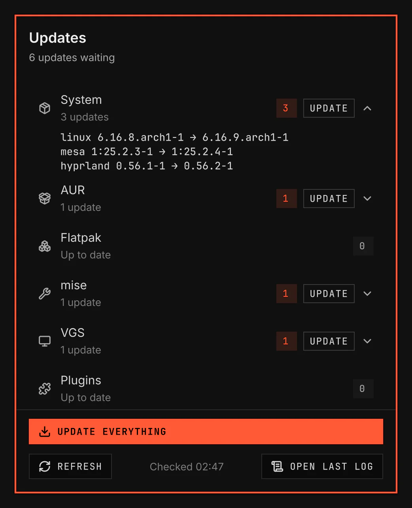

# Updates

Updates checks your system, VGS, plugins, themes and developer tools for updates, and installs them. Its bar icon shows how many wait.

Screenshot made with `scripts/readme-shots.sh` in the nested sandbox, with the default theme at scale 2.

## Features

- Checks system packages, AUR packages, Flatpak apps, mise tools, VGS itself, installed plugins and installed themes.
- Checks every six hours by default, and again when you choose Refresh.
- A bar icon with the count of waiting updates. It turns to a warning when a check fails or is stale, and spins while a check runs.
- A window on `SUPER+CTRL+U` or a click on the icon, with one row per source. A row lists its packages. Update installs one source, and Update everything installs all of them.
- Open last log shows the log of the last update run.
- Saves a system snapshot with Snapper or Timeshift before an update, when one is installed.
- An AI agent reviews packages from outside your distribution's official repositories before they install. It runs in a second window, so you can talk to it. It installs nothing and never gets administrator access. A flagged package asks you to skip it or install it anyway.
- The steps of an update run are in [pipeline.md](pipeline.md).

## Settings

| Setting | What it changes |
| --- | --- |
| Check interval | Time between automatic update checks, 1 to 48 hours. |
| Hide when up to date | Hides the bar icon only when a recent check finds no updates. |
| AUR command | How Arch User Repository packages update: Automatic, or a paru or yay command of your own. |
| System snapshot | Saves a system snapshot before updates when a snapshot tool is available. |
| Trust plugin and theme updates | Shows plugin and theme changes and applies them without confirmation. |
| Review third-party packages | An AI agent checks packages from outside your distribution's official repositories before they install. On by default. |
| AI agent | The AI agent that checks the packages: Claude Code or Codex, from the agents found. |
| Review command | The command that starts the review agent. Automatic runs the agent's default command. An edited command runs as written. |
