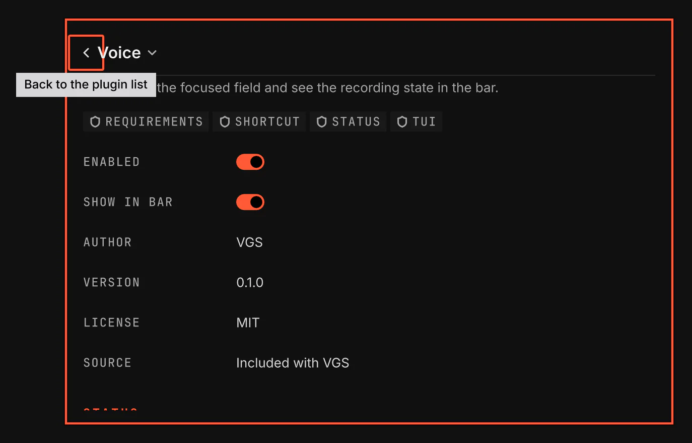
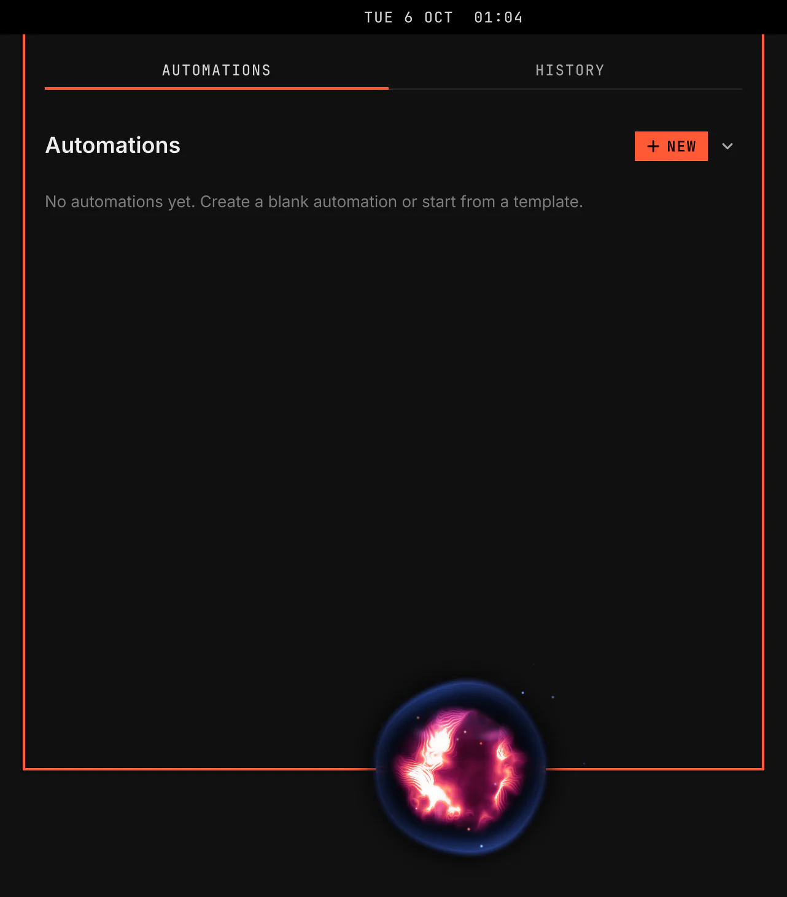

# Voice

Voice dictates into the focused field. It uses voxtype for capture, speech recognition and paste output.

Enabling the plugin puts the mic in the bar's right section.

Screenshot made with `scripts/readme-shots.sh` in the nested sandbox, with the default theme at scale 2.

## Keys

| Action | Default |
|---|---|
| Toggle dictation | `SUPER+CTRL+X` |
| Tap a key to dictate | Right Alt (`code:108`) or Right Ctrl (`code:105`), pressed and released alone |
| Dictate while held | `F9` |

Right Alt used as AltGr with another key types as usual and starts no dictation.

Change the keys in the plugin's Keys row on its Settings page.

## Setup

The Setup section of the Voice Settings page shows what voxtype reports. When Voice is ready, it shows Ready with the voxtype version and the speech model, and that the Voice service runs. Otherwise it names what is missing, and Set up comes first. When Voice is ready, Set up again runs the setup again.

When voxtype is missing, Set up, Configure and Choose model on the Voice Settings page first offer to install it. Once voxtype is installed, the screen you chose opens. A step that needs your password says so before it asks.

Set up copies the default voxtype config only when no config exists. It also copies the bloop sounds, enables the speech engine, downloads the configured model and starts the user service.

The Configure and Choose model entries open voxtype's own screens. Voice warns first when the config is a symlink, because those screens can replace it with a regular file.

## On-screen display

While Voice records, a plasma orb shows at the bottom centre of the focused screen. It swells and swirls with your voice. It turns cool and pulses while voxtype transcribes the words, then it goes away.

The orb takes no key and no click. Dictated text goes into the field you typed in, and a click goes to the window below the orb.

Set On-screen display in the Display section of the Voice page to `plasma`, the default, to `ring` for the VGS voice ring, or to `off`.

The orb reads your voice level from voxtype-audio-bridge, which comes with voxtype.

## Bar mic

The mic uses the accent tone while recording. It spins while speech is being transcribed. A click opens Configure.
