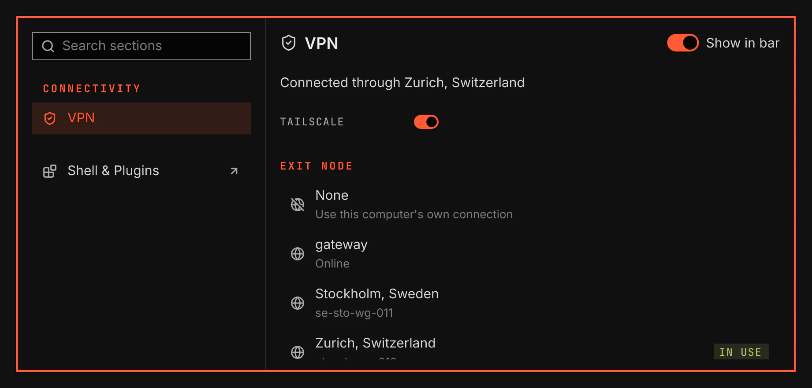

# VPN

`vgs.vpn`: see your Tailscale connection, turn it on and off, choose an exit node, switch accounts and sign in. It has a bar icon with a flyout, and a VPN section in the System window.

Screenshot made with `scripts/readme-shots.sh` in the nested sandbox, with the default theme at scale 2, over a stand-in `tailscale`.

## Where you find it

| Surface | What it holds |
|---|---|
| Bar icon | Connected, off, or an exit node in use. A click opens the flyout. It hides while Tailscale is not installed. |
| Flyout | The connection switch, Sign in while you are signed out, and the exit nodes. VPN settings opens the section. |
| System → VPN | The same, then this device, your accounts with Add account, the other devices, and Check every. |

## Connection

- The switch turns Tailscale on and off. Your Tailscale settings stay as they are.
- VGS reads Tailscale every 30 seconds while the flyout and the section are closed, and every 3 seconds while one is open. Check every sets the first figure to 10, 30 or 60 seconds.
- If Tailscale does not answer in 10 seconds, VGS stops that read and shows "Tailscale did not answer." The next read starts on time.

## Exit nodes

- The list holds None, the exit nodes of your network by name, then one Mullvad node for each city.
- A long list shows the first 80 nodes and says how many there are. The node in use always shows.
- Enter or a click routes your traffic through the selected node. None turns the exit node off.

## Accounts

- Sign in opens the Tailscale sign-in page in your browser. Add account does the same for one more account. VGS waits 5 minutes for you to finish.
- Enter or a click on an account switches to it.

## Setup

The section and the plugin's Settings page offer one step at a time:

| Step | When | What it does |
|---|---|---|
| Install | Tailscale is not installed | Opens the installation notice. |
| Enable | The Tailscale service is off | Starts the service and keeps it on after a restart, in a setup window. |
| Allow | Your account cannot change Tailscale | Makes your account the Tailscale operator, in a setup window. Changes then need no administrator password. |

Each setup window shows its commands and asks before it runs them.

## Keys

The bar takes no keyboard focus. `SUPER+PERIOD` opens the System window: type "vpn" and press Enter. In the section, Tab moves between the switch, the buttons and the lists, Space turns the switch on or off, Up and Down move in a list, and Enter chooses the selected exit node or account. Escape returns to the sidebar.

## Validation

`scripts/test-vpn-logic.js` holds the exit-node target rule, the poll's one-in-flight and watchdog rules, each command's words, the setup steps and the size of the published record, with a control for the target, poll and bound rules. `scripts/smoke/rows/vpn.sh` runs the plugin in the nested sandbox over a stand-in `tailscale` and a stand-in `xdg-open`: the switch, an exit node set by its DNS name, Allow, a held read stopped at 10 seconds, the read interval open and closed, sign-in, and the keyboard path.
