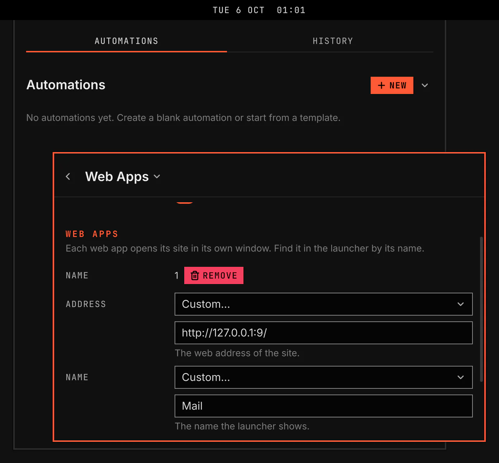

# Web Apps

Web Apps turns a website into an app. Each web app has its own name and icon in the launcher, and opens its site in its own window of the browser you already have.

Screenshot made with `scripts/readme-shots.sh` in the nested sandbox, with the default theme at scale 2.

## Features

- Add, change and remove web apps on the Web Apps page in Plugins. No file to edit.
- Find each web app in the launcher by its name, with the site's icon.
- Select a web app to open its site in a window of its own, without tabs or an address bar.
- Select it again while its window is open, and VGS brings that window into view, on whatever workspace it is.
- Remove a web app, and its launcher entry and icon go with it.

## Settings

Each web app has these fields under Web apps.

| Setting | What it changes |
| --- | --- |
| Address | The web address of the site. Pick a common site, or choose Custom… and type the address. |
| Name | The name the launcher shows. The site's own name is the default. |
| Icon | The site's own icon is the default. Choose Custom… to give the full path or the web address of an image. |

A web app opens in a browser of the Chromium family: Chromium, Google Chrome, Brave, Vivaldi, Microsoft Edge, Opera, Thorium or Helium. VGS uses your default browser when it is one of these, and otherwise the first one it finds. Firefox cannot open a site in its own window. With none of these browsers installed, the Details page says so.

Turning off or removing Web Apps leaves its web apps in the launcher. Remove them on the Web Apps page first.
