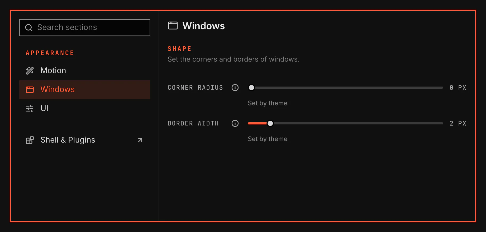

# Windows

Windows sets the corner radius and the border width of windows and flyouts, and VGlass, the frosted glass of shell surfaces and windows. It is for anyone who wants rounder, squarer or thinner window edges than the theme gives, or more or less glass.

Screenshot made with `scripts/readme-shots.sh` in the nested sandbox, with the default theme at scale 2.

## Features

- A Windows section under Appearance in the System Settings window.
- Each value shows Set by theme until you change it. Use theme value puts the theme's value back.
- One corner radius sets three shapes: windows use the full radius, flyouts three quarters of it and grouped window tabs half of it.
- A value you set applies over your own Hyprland config. Where your config sets another value, the row shows that value and offers Use my Hyprland value, which makes VGS stop setting it.
- VGlass is on everywhere, off everywhere, or each surface's own choice. The launcher and notifications have a VGlass setting each and use glass by default.
- With VGlass on for windows, Hyprland draws your windows with blur, transparency and a shadow. Off, Hyprland keeps the window look from your own Hyprland config.
- The values stay in effect when you disable this plugin. Enable it again to change them.

## Values

| Value | What it changes |
| --- | --- |
| Corner radius | The corners of windows, flyouts and grouped window tabs, from 0 to 32 px. |
| Border width | The window border, from 0 to 20 px. Use my Hyprland value also keeps your own border colours. |
| VGlass | Each surface decides, On everywhere or Off everywhere. Without glass a surface draws as a plain panel. |
| Windows | Whether Hyprland draws your windows with glass while each surface decides. |
